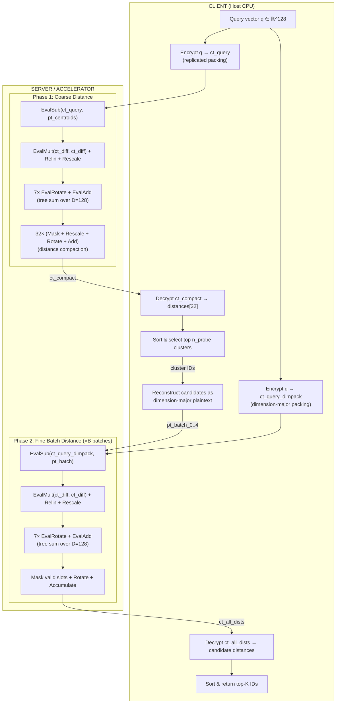
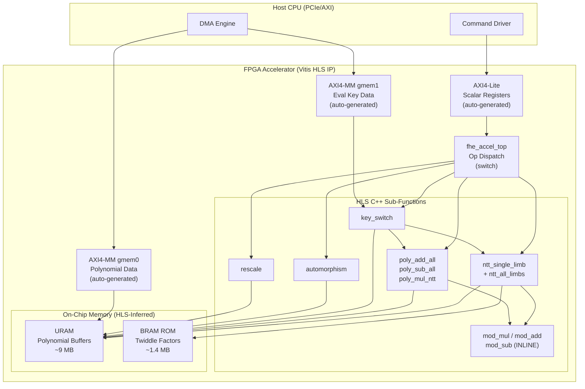

# Hardware Architecture — ANNS_FHE Accelerator

> Encrypted Interactive Search mode accelerator for IVF-PQ over CKKS FHE.

---

## 1. What exactly is represented by one hardware word?

One hardware word is a **64-bit unsigned integer** representing a single
RNS residue of a single polynomial coefficient:

$$w = a_j \bmod q_i \quad \text{where } a_j \text{ is coefficient } j, \; q_i \text{ is RNS prime } i$$

All arithmetic in the accelerator (add, subtract, multiply) operates on
these 64-bit words under modular arithmetic with respect to a specific prime $q_i$.

---

## 2. What exactly is represented by one ciphertext?

A CKKS ciphertext is an ordered pair of polynomials in the ring
$R_{Q_\ell} = \mathbb{Z}_{Q_\ell}[X]/(X^N + 1)$:

$$\text{ct} = (c_0(X),\; c_1(X))$$

At level $\ell$, each polynomial has $N$ coefficients represented in RNS
with $L_\ell = L + 1 - \ell$ limbs. Total storage:

$$\text{ct size} = 2 \times N \times L_\ell \times 8 \text{ bytes}$$

After `EvalMult(ct, ct)` (before relinearization), the result temporarily
has **three** polynomials $(d_0, d_1, d_2)$. Relinearization (key switching
on $d_2$) reduces it back to two.

---

## 3. What is the polynomial degree?

| Parameter | Software Value | HW Prototype Value |
|-----------|---------------|-------------------|
| $N$ (ring dimension) | 65536 | **16384** |
| Slots ($N/2$) | 32768 | **8192** |
| Batch size $B$ ($\text{Slots}/D$) | 256 | **64** |
| NTT stages ($\log_2 N$) | 16 | **14** |

The hardware design is **parameterized** on $N$. The default prototype
uses $N = 16384$ because:
- One polynomial fits in ~1.4 MB (vs 18 MB at $N=65536$)
- Working set of 4 polynomials fits in ~5.6 MB of URAM
- The algorithm is identical; only per-batch throughput changes

---

## 4. How are RNS limbs represented?

Each coefficient $a_j$ of a polynomial is stored as $L_\ell$ residues:

$$a_j \leftrightarrow (a_j \bmod q_0, \; a_j \bmod q_1, \; \ldots, \; a_j \bmod q_{L_\ell - 1})$$

Storage is **limb-major**: all $N$ coefficients of limb 0 are contiguous,
then all $N$ coefficients of limb 1, etc. This enables:
- Streaming one full limb through the NTT engine without address gaps
- Processing each RNS limb independently and in parallel (if multiple NTT engines)

### RNS Prime Table (HW prototype, $N=16384$, mult_depth=10)

| Limb | Purpose | Approx. bit-width | Stored in |
|------|---------|-------------------|-----------|
| $q_0$ | First modulus | 60 bits | Register |
| $q_1 \ldots q_{10}$ | Scale moduli | 45 bits each | Registers |

Barrett reduction constants $(m_i, k_i)$ for each prime are preloaded into
registers at initialization.

---

## 5. Which operations must be implemented in hardware?

These are the FHE primitives required for the **interactive search** pipeline:

| # | Operation | Description | Depth cost |
|---|-----------|-------------|------------|
| 1 | `NTT(poly, q_i)` | Forward Number Theoretic Transform, one limb | 0 |
| 2 | `INTT(poly, q_i)` | Inverse NTT, one limb | 0 |
| 3 | `CoeffMul(a, b, q_i)` | Coefficient-wise modular multiply | 0 |
| 4 | `CoeffAdd(a, b, q_i)` | Coefficient-wise modular add | 0 |
| 5 | `CoeffSub(a, b, q_i)` | Coefficient-wise modular subtract | 0 |
| 6 | `Automorphism(poly, k)` | Coefficient permutation: $a(X) \to a(X^k)$ | 0 |
| 7 | `KeySwitch(ct, evk)` | Key switching (relinearization or rotation) | 0 |
| 8 | `Rescale(ct)` | Drop last RNS limb, $L \to L-1$ | 1 level |

### Composite operations built from primitives:

| Composite | Primitives used | When used |
|-----------|----------------|-----------|
| `EvalAdd(ct, ct)` | $2 \times L_\ell$ CoeffAdd | Tree sum accumulation |
| `EvalSub(ct, pt)` | $L_\ell$ CoeffSub | Query minus centroids |
| `EvalMult(ct, ct)` | $3L_\ell$ NTT + CoeffMul + INTT + KeySwitch + Rescale | Squaring differences |
| `EvalMult(ct, pt)` | $L_\ell$ CoeffMul + Rescale | Masking with plaintext |
| `EvalRotate(ct, k)` | Automorphism + KeySwitch | Tree sum, compaction |

---

## 6. Which operations can remain outside the accelerator?

| Operation | Reason to keep on host |
|-----------|----------------------|
| `KeyGen`, `EvalMultKeyGen`, `EvalRotateKeyGen` | One-time offline, complex, no performance benefit |
| `Encrypt(pk, pt)` | Client-side in interactive model |
| `Decrypt(sk, ct)` | Client-side in interactive model |
| `MakeCKKSPackedPlaintext` | CKKS encoding (DFT + scaling) — complex, host CPU suitable |
| IVF/PQ training (k-means) | Offline preprocessing |
| Client cluster selection | Plaintext sorting of 32 values after decryption |
| Client top-K selection | Plaintext sorting of candidate distances after decryption |
| Candidate vector reconstruction | Host builds dimension-major plaintext from PQ codes + codebooks |

---

## 7. What is the hardware boundary of the proposed accelerator?

```
┌──────────────────────────────────────────────────────────────────────┐
│                          HOST CPU                                    │
│                                                                      │
│  ┌──────────┐  ┌──────────┐  ┌─────────────┐  ┌──────────────────┐  │
│  │ OpenFHE  │  │  CKKS    │  │  Plaintext   │  │   IVF-PQ Index  │  │
│  │ KeyGen   │  │ Encode/  │  │  Encrypt/    │  │   (centroids,   │  │
│  │          │  │ Decode   │  │  Decrypt     │  │    codebooks,   │  │
│  │          │  │          │  │  (client)    │  │    PQ codes)    │  │
│  └──────────┘  └──────────┘  └─────────────┘  └──────────────────┘  │
│       │              │              │                   │             │
│       └──────────────┴──────────────┴───────────────────┘             │
│                              │                                       │
│                    ┌─────────┴─────────┐                             │
│                    │  Command Sequence  │  (host orchestrates ops)    │
│                    │  + Data Transfer   │                             │
│                    └─────────┬─────────┘                             │
└──────────────────────────────┼────────────────────────────────────────┘
                               │ AXI4 / PCIe
                 ══════════════╪══════════════════════
                               │
┌──────────────────────────────┼────────────────────────────────────────┐
│                    FPGA ACCELERATOR                                   │
│                              │                                       │
│              ┌───────────────┴───────────────┐                       │
│              │      Command Processor        │                       │
│              │   (FSM: dispatch operations)   │                       │
│              └───────┬───────────┬────────────┘                       │
│                      │           │                                    │
│         ┌────────────┴──┐   ┌───┴────────────┐                       │
│         │  Polynomial   │   │  Key-Switch    │                       │
│         │  Arithmetic   │   │  Engine        │                       │
│         │  (Add/Sub/Mul)│   │  (decompose,   │                       │
│         │               │   │   NTT, MAC,    │                       │
│         │  ┌─────────┐  │   │   INTT, acc)   │                       │
│         │  │NTT Engine│ │   │                │                       │
│         │  └─────────┘  │   └────────────────┘                       │
│         └───────────────┘           │                                │
│                │                    │                                 │
│         ┌──────┴──────┐   ┌────────┴────────┐   ┌──────────────┐    │
│         │ Automorphism│   │  Rescale Unit   │   │Memory Control│    │
│         │    Unit     │   │                 │   │   (URAM/BRAM │    │
│         └─────────────┘   └─────────────────┘   │    + DDR/HBM)│    │
│                                                  └──────────────┘    │
└──────────────────────────────────────────────────────────────────────┘
```

**Boundary**: The accelerator receives pre-encoded polynomials (plaintext and
ciphertext) and evaluation keys from the host. It performs polynomial-level
FHE operations and returns result ciphertexts. The host orchestrates the
operation sequence.

---

## 8. Dataflow: Encrypted Query to Top-K Result

### 8.1 Interactive Search Pipeline



### 8.2 Operation Count Summary (per query, $N=16384$, $n_{\text{probe}}=1$)

| Phase | Operation | Count | Key switches |
|-------|-----------|-------|--------------|
| **1a: Coarse dist** | EvalSub(ct, pt) | 1 | 0 |
| | EvalMult(ct, ct) + Relin | 1 | 1 |
| | Rescale | 1 | 0 |
| | EvalRotate (tree sum) | 7 | 7 |
| | EvalAdd | 7 | 0 |
| **1b: Compaction** | EvalMult(ct, pt) | 32 | 0 |
| | Rescale | 32 | 0 |
| | EvalRotate | 32 | 32 |
| | EvalAdd | 31 | 0 |
| **2: Fine dist** (×5 batches) | EvalSub(ct, pt) | 5 | 0 |
| | EvalMult(ct, ct) + Relin | 5 | 5 |
| | Rescale | 5 | 0 |
| | EvalRotate (tree sum) | 35 | 35 |
| | EvalAdd | 35 | 0 |
| | EvalMult(ct, pt) + Rescale | 5 | 0 |
| | EvalRotate (position) | 5 | 5 |
| | EvalAdd (accumulate) | 4 | 0 |
| **TOTAL** | | | **85 key switches** |

> [!IMPORTANT]
> **Key switching dominates**: 85 key-switch operations, each requiring
> multiple NTTs and polynomial multiplies. This is the primary target
> for hardware acceleration.

---

## 9. Where are BRAM/URAM memories required?

| Resource | Contents | Capacity needed ($N$=16384, $L$=11) |
|----------|---------|--------------------------------------|
| **URAM** | Active polynomials (working set of 6-8 polys) | 8–12 MB |
| **URAM** | Partial key-switch accumulator (2 polys) | ~2.8 MB |
| **BRAM** | NTT twiddle factor ROMs (per prime) | 11 × 128 KB = 1.4 MB |
| **BRAM** | Barrett reduction constants | < 1 KB |
| **BRAM** | Command queue / control FIFOs | < 64 KB |
| **DDR/HBM** | Evaluation keys (relin + rotation) | ~700 MB |
| **DDR/HBM** | Input/output ciphertexts | ~3–6 MB each |

### URAM Budget (Alveo U280: ~90 MB URAM)

Working set during key-switch (the peak):
- Input ct polynomial ($c_1$): 1.4 MB
- Key-switch accumulator (2 polys): 2.8 MB
- Eval key digit (streamed, double-buffered): 2 × 1.4 = 2.8 MB
- Result polynomial: 1.4 MB
- **Peak: ~8.4 MB** — fits comfortably

---

## 10. Where are DSPs expected to be used?

| Module | DSP Operation | DSPs per unit | Units | Total DSPs |
|--------|--------------|---------------|-------|------------|
| `mod_mul_64` | 64×64→128 bit multiply | 8 DSP48E2 | 8–16 | 64–128 |
| `ntt_butterfly` | twiddle × coefficient | (reuses mod_mul_64) | 8–16 | (shared) |
| `mod_add_sub_64` | 64-bit add/sub | 0 (LUT-based) | — | 0 |
| **Total estimate** | | | | **64–128 DSP48E2** |

> Each DSP48E2 performs a 27×18-bit multiply. A 64×64-bit multiply under
> Barrett reduction requires decomposition into 4–9 partial products
> depending on the implementation strategy (Karatsuba vs schoolbook).

---

## 11. Implementation Strategy: Vitis HLS-First

All compute modules are implemented as **synthesizable HLS C++** functions.
Vitis HLS auto-generates AXI interfaces and memory controllers. SystemVerilog
is used only for the Vivado block-design integration wrapper (if needed).

| Component | Implementation | Rationale |
|-----------|---------------|-----------|
| `mod_mul`, `mod_add`, `mod_sub` | HLS C++ (`#pragma HLS INLINE`) | Inlined into caller; `ap_uint<128>` maps to DSPs automatically |
| `ntt_single_limb` | HLS C++ function | Regular loop nest; `PIPELINE` + `UNROLL` achieve butterfly parallelism |
| `poly_add_all`, `poly_sub_all`, `poly_mul_ntt` | HLS C++ functions | Simple streaming loops with `PIPELINE II=1` |
| `automorphism` | HLS C++ function | Index permutation loop; no DSPs needed |
| `key_switch` | HLS C++ function | Most complex; nested loops + AXI memory streaming for eval keys |
| `rescale` | HLS C++ function | Streaming coefficient loop with `PIPELINE II=1` |
| `fhe_accel_top` | HLS C++ top-level kernel | Op-code dispatch `switch`; AXI interfaces via pragmas |
| Vivado block design | TCL script | Instantiates HLS IP + AXI interconnect + DDR/HBM controller |

---

## 12. What parameters should be compile-time constants?

```cpp
// hls_params.h
constexpr int N          = 16384;  // Polynomial degree
constexpr int LOG2_N     = 14;     // = log2(N)
constexpr int MAX_LIMBS  = 11;     // Maximum RNS chain length
constexpr int WORD_BITS  = 64;     // Bits per RNS residue
constexpr int NUM_BFLY   = 8;      // Parallel butterfly units in NTT
constexpr int AXI_WIDTH  = 512;    // AXI data bus width (bits)
constexpr int WORDS_PER_BEAT = AXI_WIDTH / WORD_BITS; // = 8
constexpr int POLY_WORDS = N;      // Words per single limb
constexpr int POLY_TOTAL = N * MAX_LIMBS; // Words per full polynomial
constexpr int CT_TOTAL   = 2 * POLY_TOTAL; // Words per ciphertext
```

---

## 13. What parameters should be runtime configurable?

These are passed as kernel arguments and mapped to AXI-Lite scalar registers
via `#pragma HLS INTERFACE s_axilite`:

```cpp
// Passed as function arguments to fhe_accel_top()
uint64_t rns_primes[MAX_LIMBS];  // q_0 .. q_L
uint64_t barrett_m[MAX_LIMBS];   // Barrett reduction multipliers
uint32_t barrett_k[MAX_LIMBS];   // Barrett shift amounts
uint64_t n_inv[MAX_LIMBS];       // N^{-1} mod q_i for INTT scaling
uint32_t active_limbs;           // Current number of active RNS limbs
uint32_t galois_elt;             // Galois element for automorphism
uint32_t dnum;                   // Key-switch decomposition count
```

---

## 14. Module Hierarchy and I/O Contracts (HLS C++ Functions)

### 14.1 `mod_mul` / `mod_add` / `mod_sub` — Modular Arithmetic (Inline)

```cpp
inline uint64_t mod_mul(uint64_t a, uint64_t b, uint64_t q,
                        uint64_t m, uint32_t k);  // #pragma HLS INLINE
inline uint64_t mod_add(uint64_t a, uint64_t b, uint64_t q);
inline uint64_t mod_sub(uint64_t a, uint64_t b, uint64_t q);
```

| Property | Value |
|----------|-------|
| HLS directive | `#pragma HLS INLINE` — absorbed into caller |
| 128-bit product | `ap_uint<128>` auto-maps to DSP48E2 chains |
| Latency | HLS-scheduled (target: II=1 when pipelined in caller) |

### 14.2 `ntt_single_limb` — N-Point NTT/INTT

```cpp
void ntt_single_limb(uint64_t poly[N], const uint64_t twiddles[N/2],
                     uint64_t q, uint64_t bm, uint32_t bk,
                     uint64_t n_inv_val, bool inverse);
```

| Property | Value |
|----------|-------|
| On-chip buffer | `uint64_t buf[N]` → URAM via `#pragma HLS BIND_STORAGE` |
| Parallelism | `#pragma HLS UNROLL factor=NUM_BFLY` on butterfly loop |
| Twiddle storage | `uint64_t tw[N/2]` → BRAM ROM |
| Cycles/limb | $N/2 \times \log_2(N) / \text{NUM\_BFLY} \approx 14,336$ |

### 14.3 `poly_add_all` / `poly_sub_all` / `poly_mul_ntt` — Polynomial Ops

```cpp
void poly_add_all(uint64_t dst[], const uint64_t a[], const uint64_t b[],
                  const uint64_t primes[], int active_limbs);
void poly_mul_ntt_domain(uint64_t dst[], const uint64_t a[], const uint64_t b[],
                         const uint64_t primes[], const uint64_t bm[],
                         const uint32_t bk[], int active_limbs);
```

| Property | Value |
|----------|-------|
| Inner loop | `#pragma HLS PIPELINE II=1` |
| Cycles | $N \times L$ per operation (streaming) |

### 14.4 `key_switch` — Key Switching

```cpp
void key_switch(uint64_t ct1_poly[MAX_LIMBS * N],
                uint64_t result_0[MAX_LIMBS * N],
                uint64_t result_1[MAX_LIMBS * N],
                const uint64_t* evk_gmem,  // AXI-MM port to DDR/HBM
                const uint64_t twiddles[], const uint64_t primes[],
                const uint64_t bm[], const uint32_t bk[],
                const uint64_t n_inv[], int active_limbs, int dnum);
```

| Property | Value |
|----------|-------|
| On-chip accumulators | `acc_0[MAX_LIMBS*N]`, `acc_1[MAX_LIMBS*N]` → URAM |
| Eval key streaming | Read from `evk_gmem` via AXI-MM, one digit at a time |
| Latency ($d_{\text{num}}=3$, $L=11$) | ~1.1M cycles |

### 14.5 `automorphism` — Galois Permutation

```cpp
void automorphism(uint64_t dst[], const uint64_t src[],
                  uint32_t galois_elt, const uint64_t primes[],
                  int active_limbs);
```

| Property | Value |
|----------|-------|
| Latency | $N \times L$ cycles (streaming) |
| DSPs | 0 |

### 14.6 `rescale` — CKKS Rescale

```cpp
void rescale(uint64_t ct[2 * MAX_LIMBS * N],
             const uint64_t primes[], const uint64_t bm[],
             const uint32_t bk[], int active_limbs);
```

| Property | Value |
|----------|-------|
| Latency | ~$2 \times N \times L$ cycles |

### 14.7 `fhe_accel_top` — Top-Level Kernel

```cpp
extern "C" void fhe_accel_top(
    ap_uint<512>* poly_gmem,   // #pragma HLS INTERFACE m_axi bundle=gmem0
    ap_uint<512>* key_gmem,    // #pragma HLS INTERFACE m_axi bundle=gmem1
    uint32_t op_code,          // #pragma HLS INTERFACE s_axilite
    uint32_t src_a_offset,     // ...
    uint32_t src_b_offset,
    uint32_t dst_offset,
    uint64_t evk_offset,
    uint32_t active_limbs,
    uint32_t prime_idx,
    uint32_t galois_elt,
    uint32_t dnum,
    uint64_t rns_primes[MAX_LIMBS],
    uint64_t barrett_m[MAX_LIMBS],
    uint32_t barrett_k[MAX_LIMBS],
    uint64_t n_inv[MAX_LIMBS]
);
```

**Dispatch**: Internal `switch(op_code)` calls the appropriate sub-function.
AXI interfaces are auto-generated by Vitis HLS from the pragma annotations.

---

## 15. Estimated Per-Query Cycle Budget

At 250 MHz clock, $N=16384$, $L=11$, `NUM_BFLY=8`:

| Component | Count | Cycles each | Total cycles |
|-----------|-------|-------------|--------------|
| NTT/INTT (per limb) | ~500 | 14,336 | 7,168,000 |
| Key-switch (full) | 85 | ~1,100,000 | 93,500,000 |
| Poly add/sub (all limbs) | ~80 | 180,224 | 14,417,920 |
| Poly mul (all limbs, NTT domain) | ~40 | 180,224 | 7,208,960 |
| Automorphism (all limbs) | 85 | 180,224 | 15,319,040 |
| Rescale | ~45 | 360,448 | 16,220,160 |
| **Total** | | | **~154M cycles** |
| **Time at 250 MHz** | | | **~616 ms** |

> [!NOTE]
> HLS may not achieve II=1 everywhere on the first synthesis pass.
> Initial implementation will likely be 1.5–2× slower than these targets.
> Optimize iteratively after functional correctness is established.
> The software reference takes ~2–10 seconds per query (single-threaded OpenFHE),
> so even a conservative HLS implementation provides meaningful speedup.

---

## 16. Top-Level Block Diagram



---

## 17. Places Where the Original Thesis Plan Is Too Ambitious

> [!CAUTION]
> The following aspects of a full FHE accelerator exceed what is feasible
> for a master's thesis HLS prototype:

| Aspect | Why it's too ambitious | Recommended scope |
|--------|----------------------|-------------------|
| Full $N=65536$ support | 36 MB per ciphertext; exceeds on-chip memory | Use $N=16384$ |
| On-chip eval key storage | 700+ MB of keys | Stream from DDR/HBM via AXI-MM |
| Multiple NTT engines | Complex arbitration, diminishing returns at prototype stage | Start with 1 NTT (increase `NUM_BFLY` instead) |
| Full PCIe host integration | Significant engineering overhead | AXI interfaces auto-generated by HLS; Vivado block design for system |
| Homomorphic sign/indicator (non-interactive mode) | Requires Chebyshev evaluation engine, deep multiplicative depth | Target interactive mode only |
| Homomorphic sorting/ranking | Requires matrix operations + comparison polynomials | Exclude from hardware |
| Real-time key bandwidth management | Complex memory scheduling | Assume keys available when needed |
| Bootstrapping | Not used in the software; would require separate deep circuit | Explicitly exclude |

### Recommended Thesis Scope

Implement an **HLS C++ accelerator kernel** for the core compute datapath
(NTT + modular arithmetic + key-switch + automorphism + rescale) with:
- Parameterized $N$ (default 16384) via `constexpr` in `hls_params.h`
- Test vectors from OpenFHE for C simulation and C/RTL co-simulation
- Vitis HLS C synthesis for resource/latency/scheduling reports
- Vivado synthesis and implementation for post-place-and-route LUT/FF/BRAM/URAM/DSP/timing/power
- AXI interfaces auto-generated by Vitis HLS (no hand-coded AXI logic)
- Evaluation keys streamed from simulated DDR/HBM via AXI-MM port
