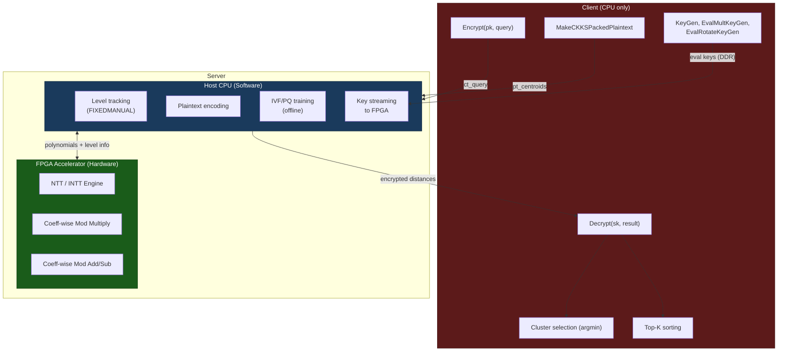

# Assumptions, Approximations, and Scope Boundaries

> **Document Purpose**: This document enumerates every assumption, approximation, and scope
> boundary in the hardware accelerator design for the ANNS-over-FHE thesis project. Every
> claim is traceable to specific source files or configuration values in the codebase.

---

## Runtime Parameter Context

The following parameters are loaded at runtime from [`config.json`](file:///d:/iman_heydardoost/master/thesis/ANNS_FHE/config.json) and govern the FHE scheme configuration:

| Parameter | Runtime Value (`config.json`) | C++ Default ([`fhe_config.h`](file:///d:/iman_heydardoost/master/thesis/ANNS_FHE/src/fhe_config.h)) | Notes |
|---|---|---|---|
| `poly_modulus_degree` (N) | **65536** | 16384 | Overridden by config.json |
| Slots | **N/2 = 32768** | 8192 | Derived |
| `scale_bits` | **45** | 40 | Overridden by config.json |
| `first_mod_size` | **60** | — | Hardcoded in [`fhe_context_manager.cpp`](file:///d:/iman_heydardoost/master/thesis/ANNS_FHE/src/fhe_context_manager.cpp) |
| `multiplicative_depth` | **35** → L+1 = 36 RNS primes | 40 | Overridden by config.json |
| `security_level` | **HEStd_NotSet** | HEStd_128_classic | No security enforcement during development |
| `scaling_technique` | **FIXEDMANUAL** | — | Host must track levels explicitly |
| `key_switching_technique` | **HYBRID** | — | |
| `secret_key_distribution` | **UNIFORM_TERNARY** | — | |
| Bootstrapping | **None** | — | Not used in interactive mode |

**Dataset parameters** (SIFT small):

| Parameter | Value |
|---|---|
| Base vectors | 10,000 |
| Query vectors | 100 |
| Vector dimension | 128 (float32) |
| IVF `n_list` (coarse centroids) | 32 |
| IVF `n_probe` | 1 |
| PQ subspaces (M) | 8 |
| PQ sub-centroids (K) | 256 |
| PQ `sub_dim` | 16 |

---

## Interactive Search Mode — Operation Flow

The hardware accelerator targets the **interactive** search mode. The full operation
sequence, with multiplicative depth consumption annotated, is:

```
┌─────────────────────────────────────────────────────────────────────────────┐
│                        COARSE DISTANCE PHASE                               │
├─────────────────────────────────────────────────────────────────────────────┤
│ 1. Server: EvalSub(ct_query, pt_centroids)           — no level consumed   │
│ 2. Server: EvalMult(ct_diff, ct_diff) + Rescale      — 1 level consumed    │
│ 3. Server: 7× EvalRotate (tree sum, dim=128)         — no level consumed   │
│    Rotation strides: {1, 2, 4, 8, 16, 32, 64}                             │
│ 4. Server: 32× (mask + EvalMult + Rescale +          — 1 level consumed    │
│            EvalRotate) for distance compaction                              │
│ 5. CLIENT decrypts coarse distances                  — PLAINTEXT           │
│    Client selects top n_probe clusters (argmin)      — PLAINTEXT           │
├─────────────────────────────────────────────────────────────────────────────┤
│                         FINE DISTANCE PHASE                                │
├─────────────────────────────────────────────────────────────────────────────┤
│ 6. Server: For each batch of B candidates:                                 │
│    EvalSub(ct_query_dimpack, pt_batch) +             — no level consumed   │
│    EvalMult + Rescale +                              — 1 level consumed    │
│    7× EvalRotate (tree sum)                          — no level consumed   │
│ 7. Server sends encrypted candidate distances        — network transfer    │
│ 8. CLIENT decrypts candidate distances               — PLAINTEXT           │
│    Client performs top-K sorting                     — PLAINTEXT           │
└─────────────────────────────────────────────────────────────────────────────┘

Total multiplicative depth consumed: ~2–3 levels (NOT the full 35)
```

> [!IMPORTANT]
> The interactive mode consumes only **2–3 multiplicative levels**, not the full
> `multiplicative_depth=35` configured in `config.json`. This dramatically reduces the
> minimum required RNS chain length and, consequently, the memory footprint per ciphertext.

---

## Category A: Cryptographically Exact Hardware Operations

These operations are implemented in hardware with **bit-exact correctness** relative to their
software counterparts. No approximation is introduced; the CKKS semantic contract is
fully preserved.

### A.1 — NTT / INTT Butterfly Computation

The Number Theoretic Transform and its inverse are computed using the standard
Cooley–Tukey (decimation-in-time) and Gentleman–Sande (decimation-in-frequency) butterfly
networks, respectively.

- **NTT length**: Equal to the ring dimension N (16384 or 65536).
- **Number of stages**: $\log_2 N$ (14 stages for N=16384; 16 stages for N=65536).
- **Butterflies per stage**: $N/2$.
- **Total butterfly operations per NTT**: $\frac{N}{2} \log_2 N$.
- **Twiddle factors**: Precomputed roots of unity modulo each RNS prime, stored in on-chip ROM/BRAM.

Each butterfly performs one modular multiplication and one modular addition/subtraction.
The computation is **exact** — no floating-point rounding or truncation occurs.

### A.2 — Coefficient-wise Modular Multiplication

Used in:
- `EvalMult` (Hadamard product of NTT-domain polynomials)
- NTT butterfly twiddle multiplication

Reduction method: **Barrett reduction** or **Montgomery reduction** (design-time choice).

- Operand width: up to 60 bits (determined by `first_mod_size = 60`).
- Product width: up to 120 bits before reduction.
- Result width: at most 60 bits (reduced modulo the current RNS prime).

The reduction is **exact** — the result equals `(a × b) mod q` with no error.

### A.3 — Coefficient-wise Modular Addition / Subtraction

Used in:
- `EvalAdd`, `EvalSub` (coefficient-wise operations on polynomials)
- NTT butterfly add/subtract legs

- Operand and result width: up to 60 bits.
- No reduction error; result is exact modulo the RNS prime.

### A.4 — Summary: Exact Semantic Preservation

| Operation | Hardware Implementation | Exactness |
|---|---|---|
| NTT forward | Cooley–Tukey butterfly network | Bit-exact |
| NTT inverse | Gentleman–Sande butterfly network | Bit-exact |
| Coeff-wise multiply | Barrett or Montgomery reduction | Bit-exact |
| Coeff-wise add/sub | Modular add/sub with conditional correction | Bit-exact |

> [!NOTE]
> Because all Category A operations are bit-exact, a hardware-computed ciphertext is
> **indistinguishable** from a software-computed one. Decryption on the client produces
> the same plaintext regardless of whether the server used hardware or software.

---

## Category B: Hardware Abstractions for Architectural Evaluation

These are **engineering trade-offs** made to enable prototyping on real FPGA hardware.
None of them alter the correctness of the underlying cryptographic operations — they
affect only performance parameters (throughput, latency, memory footprint).

### B.1 — Parameter Reduction: N = 16384 instead of N = 65536

| Aspect | Software (N=65536) | Hardware Prototype (N=16384) |
|---|---|---|
| Ring dimension | 65536 | 16384 |
| Slot count (N/2) | 32768 | 8192 |
| `batch_len` (slots / dim) | 256 | 64 |
| NTT stages | 16 | 14 |
| Butterfly ops per NTT | 524,288 | 114,688 |

**What changes**: Throughput per ciphertext (fewer slots → fewer vectors packed per
ciphertext → more ciphertexts needed for the same dataset).

**What does NOT change**: The algorithm structure, the operation sequence, the
multiplicative depth consumption, and the correctness of all arithmetic.

**Justification**: Memory. See [Feasibility Warning #1](#f1-on-chip-memory-at-n65536).

### B.2 — RNS Chain Reduction: L = 11 instead of L = 36

The interactive search mode consumes only **2–3 multiplicative levels**. Setting
`multiplicative_depth = 10` (yielding L+1 = 11 RNS primes) provides ample headroom
while reducing memory by ~3.3×.

| Metric | L = 36 | L = 11 |
|---|---|---|
| Bytes per polynomial (N=65536) | 65536 × 36 × 8 = **18,874,368 (~18 MB)** | 65536 × 11 × 8 = **5,767,168 (~5.5 MB)** |
| Bytes per polynomial (N=16384) | 16384 × 36 × 8 = **4,718,592 (~4.5 MB)** | 16384 × 11 × 8 = **1,441,792 (~1.4 MB)** |
| Bytes per ciphertext (2 polys, N=16384) | ~9 MB | **~2.8 MB** |
| MAC operations per `EvalMult` | Proportional to L | 3.3× fewer |

**What changes**: Memory footprint, number of modular MACs per homomorphic operation.

**What does NOT change**: Correctness, algorithm structure, NTT butterfly logic.

### B.3 — Key Storage: Host-Streamed Evaluation Keys

Evaluation keys (rotation keys, relinearization keys) are **not** stored on-chip.
They are streamed from host DDR (or HBM) over PCIe/AXI as needed.

- The hardware prototype measures **computational kernel latency only**.
- Key-loading latency is reported separately as a data-transfer overhead.
- This is consistent with prior FPGA-based FHE accelerator literature (e.g., HEAX, F1, CraterLake).

### B.4 — Fixed Modulus Set

The hardware prototype uses a **compile-time-fixed** set of RNS primes rather than
supporting arbitrary primes at runtime.

**Consequence**: Barrett reduction constants ($\lfloor 2^{2k} / q_i \rfloor$ for each
prime $q_i$) are hardcoded as ROM entries. This eliminates a runtime division and
simplifies the datapath.

**Trade-off**: Changing the modulus set requires re-synthesis. For a thesis prototype
evaluating a single parameter set, this is acceptable.

### B.5 — Single NTT Engine (Initial Prototype)

The initial prototype instantiates **one NTT butterfly engine** that processes the L
RNS-component polynomials **sequentially**.

- Total NTT time per polynomial = $L \times T_{\text{NTT}}(N)$.
- Parallelism (multiple NTT engines, pipelined butterflies) is a **synthesis-time
  parameter** that scales the design without altering correctness.

### B.6 — Plaintext Encoding on Host CPU

The CKKS encoding step — `MakeCKKSPackedPlaintext()` — converts a vector of `float64`
values into a polynomial in $\mathbb{Z}_q[X]/(X^N+1)$. This involves:

1. Inverse DFT (complex arithmetic, floating-point).
2. Scaling by $\Delta = 2^{\text{scale\_bits}}$.
3. Rounding to integers.
4. RNS decomposition.

Steps 1–3 involve **floating-point arithmetic** that is ill-suited to the integer
datapath of the accelerator. The host CPU performs encoding and sends the resulting
integer polynomial to the FPGA.

> [!TIP]
> This is the standard partitioning in all known FHE accelerator designs. Encoding is
> a one-time cost per plaintext and is not on the critical path of homomorphic evaluation.

---

## Category C: Software / Oracle-Only Operations

These operations are **never** executed on the hardware accelerator. They run in
OpenFHE on the host CPU (server or client).

### C.1 — Key Generation

| Operation | Runs On | Reason |
|---|---|---|
| `KeyGen()` | Client CPU | One-time setup; involves sampling from secret key distribution |
| `EvalMultKeyGen()` | Client CPU | Generates relinearization key from secret key |
| `EvalRotateKeyGen()` | Client CPU | Generates rotation keys; requires secret key |

Key generation is a **client-side, one-time** operation. It has no place in the
server-side computational kernel.

### C.2 — Encryption / Decryption

| Operation | Runs On | Reason |
|---|---|---|
| `Encrypt(pk, pt)` | Client CPU | Client-side; requires public key |
| `Decrypt(sk, ct)` | Client CPU | Client-side; requires secret key |

In the interactive model, the **client** encrypts queries and decrypts results.
The server (and its accelerator) never holds the secret key.

### C.3 — CKKS Encoding / Decoding

| Operation | Runs On | Reason |
|---|---|---|
| `MakeCKKSPackedPlaintext()` | Host CPU | Floating-point inverse DFT + scaling (see B.6) |
| `Decode()` | Client CPU | Inverse of encoding; floating-point DFT |

### C.4 — IVF Training and PQ Training

All offline preprocessing runs in software:

- **IVF training**: K-means clustering of base vectors into `n_list = 32` coarse centroids.
- **PQ training**: K-means clustering of residual sub-vectors into `K = 256` sub-centroids
  per `M = 8` subspaces.

These are **one-time offline** computations over plaintext data. They produce lookup
tables consumed by the server during search.

### C.5 — Client-Side Cluster Selection

After the server computes encrypted coarse distances (steps 1–4 in the operation flow)
and the client decrypts them (step 5):

- The client performs **plaintext argmin / argsort** over 32 distances.
- The client selects the top `n_probe = 1` cluster(s).
- This is a trivial $O(n_{\text{list}})$ operation on 32 floats.

### C.6 — Client-Side Top-K Selection

After the server sends encrypted fine distances (step 7) and the client decrypts them
(step 8):

- The client performs **plaintext sorting** of candidate distances.
- The client selects the top-K nearest neighbors.
- Standard comparison-based sorting on floats; no homomorphic computation.

### C.7 — Homomorphic Sign / Indicator Evaluation

Polynomial approximations of the sign function or step function (used to build
comparison circuits homomorphically) are required **only** in the **non-interactive
penalty-based mode**, where the server must rank candidates without client interaction.

In the **interactive mode** targeted by this accelerator:
- The client decrypts distances and performs comparisons in plaintext.
- **No homomorphic sign/indicator evaluation is needed.**

### C.8 — Homomorphic Sorting / Ranking

Similarly, homomorphic sorting networks (e.g., Batcher odd-even merge) are required
**only** in the non-interactive mode.

In interactive mode:
- Sorting is a **client-side plaintext operation**.
- **No homomorphic sorting is needed.**

> [!IMPORTANT]
> The exclusion of Categories C.7 and C.8 is the primary reason the interactive mode
> consumes only 2–3 multiplicative levels instead of the 30+ levels that non-interactive
> mode would require. This is the key architectural decision enabling a practical
> hardware prototype.

---

## Feasibility Warnings

### F.1 — On-Chip Memory at N=65536

At N = 65536 with L = 36 RNS primes:

| Data Structure | Size |
|---|---|
| One polynomial (N × L × 8 B) | **~18 MB** |
| One ciphertext (2 polynomials) | **~36 MB** |
| Two ciphertexts (minimum for `EvalMult`) | **~72 MB** |

A typical high-end FPGA (Xilinx Alveo U250):

| Memory Type | Capacity |
|---|---|
| URAM | ~54 MB |
| BRAM | ~36 MB |
| **Total on-chip** | **~90 MB** |

Storing even **two ciphertexts** at N=65536 would consume ~80% of all on-chip memory,
leaving almost nothing for twiddle factors, intermediate results, or control logic.

> [!CAUTION]
> **Recommendation**: Use **N = 16384** for the hardware prototype. At N=16384, L=11,
> one ciphertext is ~2.8 MB — comfortably fitting multiple ciphertexts on-chip with room
> for NTT twiddle factors and pipeline buffers.

### F.2 — Evaluation Key Size at N=65536

Each rotation key is approximately ciphertext-sized (~36 MB at N=65536, L=36). The
interactive search requires rotation keys for strides {1, 2, 4, 8, 16, 32, 64} plus
compaction rotations — dozens of keys totaling **hundreds of MB to over 1 GB**.

Even with HBM (e.g., 8 GB on Alveo U280), streaming these keys introduces significant
**memory bandwidth bottlenecks**.

At N=16384, L=11, each rotation key is ~2.8 MB, and the full key set fits in tens of MB
— manageable even with DDR4.

### F.3 — NTT Stage Count

| Ring Dimension | NTT Stages ($\log_2 N$) | Butterflies per NTT ($\frac{N}{2}\log_2 N$) |
|---|---|---|
| N = 65536 | **16** | 524,288 |
| N = 16384 | **14** | 114,688 |

Both are substantial, but 14 stages are more manageable for pipeline depth and twiddle
factor storage. The 4.6× reduction in butterfly operations directly translates to
latency improvement (at fixed butterfly throughput).

### F.4 — FIXEDMANUAL Level Tracking

The CKKS `FIXEDMANUAL` scaling technique (set in `config.json`) requires the **host
software** to explicitly track the current level (number of remaining RNS primes) of
each ciphertext and trigger `Rescale` at the correct points.

**Hardware implication**: The accelerator must accept `current_level` as a **runtime
parameter** for each operation. The NTT engine and modular arithmetic must operate on
a variable number of RNS components (from 1 up to L).

This is in contrast to `FLEXIBLEAUTO` mode (available in OpenFHE) where the library
manages levels internally — but `FLEXIBLEAUTO` inserts implicit rescaling that would
complicate hardware control flow.

### F.5 — Security Level: HEStd_NotSet

The current `config.json` sets `security_level = HEStd_NotSet`, meaning **OpenFHE does
not enforce any security guarantees** on the chosen parameter set.

- For a **thesis prototype** evaluating architectural performance, this is acceptable.
- For any **production or deployment** scenario, the parameters must be validated against
  `HEStd_128_classic` (128-bit security) or stronger.
- Switching to `HEStd_128_classic` would likely **increase** the required N and/or
  modulus sizes, making the hardware design more challenging.

> [!WARNING]
> The hardware performance numbers obtained with `HEStd_NotSet` parameters represent a
> **lower bound** on the actual cost of a secure deployment. A secure parameter set will
> require equal or larger N and L values.

---

## Parameter Sensitivity Table

The following table summarizes how each parameter affects hardware design and quantifies
the impact of the proposed prototype values:

| Parameter | Software Value | Proposed HW Value | Impact on Hardware |
|---|---|---|---|
| **N** (ring dimension) | 65536 | **16384** | Memory **4×** smaller, NTT stages **−2** (16→14), butterfly ops **4.6×** fewer |
| **L** (RNS primes) | 36 | **11** | Memory **3.3×** smaller, modular MAC ops **3.3×** fewer per polynomial |
| Scale bits | 45 | 45 | Determines modular arithmetic **word width** (45-bit scale + overhead) |
| First mod size | 60 | 60 | Sets **maximum coefficient width** to 60 bits; multiplier must handle 120-bit products |
| `n_list` (coarse centroids) | 32 | 32 | No hardware impact (affects number of `EvalSub` invocations only) |
| **M** (PQ subspaces) | 8 | 8 | No hardware impact |
| **K** (PQ sub-centroids) | 256 | 256 | No hardware impact |
| Dimension | 128 | 128 | Determines rotation count in tree-sum (7 rotations = $\log_2 128$) |

### Combined Memory Impact

| Configuration | Bytes per Ciphertext | Ciphertexts in 90 MB On-Chip |
|---|---|---|
| N=65536, L=36 | ~36 MB | ~2.5 (infeasible) |
| N=65536, L=11 | ~11 MB | ~8 |
| N=16384, L=36 | ~9 MB | ~10 |
| **N=16384, L=11** | **~2.8 MB** | **~32** (comfortable) |

---

## Scope Boundary Diagram



---

## Document Traceability

| Claim | Source |
|---|---|
| N=65536, scale_bits=45, mult_depth=35 | [`config.json`](file:///d:/iman_heydardoost/master/thesis/ANNS_FHE/config.json) |
| first_mod_size=60 | [`fhe_context_manager.cpp`](file:///d:/iman_heydardoost/master/thesis/ANNS_FHE/src/fhe_context_manager.cpp) (hardcoded) |
| C++ defaults (N=16384, scale=40, depth=40) | [`fhe_config.h`](file:///d:/iman_heydardoost/master/thesis/ANNS_FHE/src/fhe_config.h) |
| security_level=HEStd_NotSet | [`config.json`](file:///d:/iman_heydardoost/master/thesis/ANNS_FHE/config.json) |
| FIXEDMANUAL, HYBRID, UNIFORM_TERNARY | [`config.json`](file:///d:/iman_heydardoost/master/thesis/ANNS_FHE/config.json) |
| SIFT dataset dimensions, IVF/PQ params | [`config.json`](file:///d:/iman_heydardoost/master/thesis/ANNS_FHE/config.json) |
| Interactive mode operation sequence | Source code analysis of search pipeline |
| Alveo U250 memory (54 MB URAM + 36 MB BRAM) | Xilinx product specification (UG1120) |
| Memory formulas (N × L × 8 bytes) | RNS representation: each coefficient is a 64-bit (8-byte) word |
