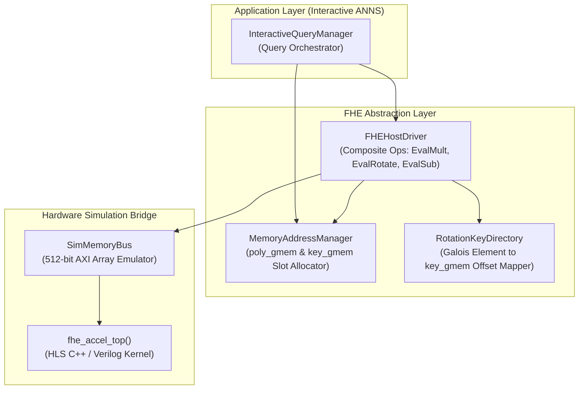

# Host Orchestrator & Composite Driver Design

> **Component:** `cpp_host_model/`  
> **Role:** High-level query orchestration, memory layout allocation, and composite FHE pipeline execution  
> **Target Accelerator Interface:** `fhe_accel_top()` C++ / RTL Kernel

---

## 1. System Architecture

The host orchestrator bridges high-level encrypted IVF-PQ algorithmic logic with the low-level FPGA kernel:



---

## 2. Core Modules & Class Interfaces

### 2.1 `SimMemoryBus` (AXI Global Memory Bridge)

Wraps virtual DRAM buffers and manages 512-bit beat packing/unpacking:

```cpp
// cpp_host_model/src/sim_memory_bus.h
#pragma once
#include <vector>
#include <cstdint>
#include <ap_int.h>

class SimMemoryBus {
public:
    SimMemoryBus(size_t poly_words = 4194304, size_t key_words = 134217728);
    
    // Direct pointer access for HLS kernel invocation
    ap_uint<512>* poly_gmem_ptr();
    ap_uint<512>* key_gmem_ptr();

    // Word read/write helpers
    void write_poly(uint32_t offset_words, const uint64_t* data, size_t count);
    void read_poly(uint32_t offset_words, uint64_t* data, size_t count);
    
    void write_key(uint64_t offset_words, const uint64_t* data, size_t count);
    void read_key(uint64_t offset_words, uint64_t* data, size_t count);

private:
    std::vector<ap_uint<512>> m_poly_gmem;
    std::vector<ap_uint<512>> m_key_gmem;
};
```

---

### 2.2 `FHEHostDriver` (Composite Operations Engine)

Translates high-level FHE expressions into sequences of `fhe_accel_top()` invocations:

```cpp
// cpp_host_model/src/fhe_host_driver.h
#pragma once
#include "sim_memory_bus.h"
#include <cstdint>

struct FHEContextConfig {
    uint32_t N;
    uint32_t max_limbs;
    uint64_t rns_primes[15];
    uint64_t p_primes[4];
    ap_uint<128> barrett_m_q[15];
    uint32_t barrett_k_q[15];
    ap_uint<128> barrett_m_p[4];
    uint32_t barrett_k_p[4];
    uint64_t n_inv_q[15];
    uint64_t n_inv_p[4];
    uint64_t n_inv_mod_q_last;
};

class FHEHostDriver {
public:
    FHEHostDriver(SimMemoryBus* bus, const FHEContextConfig& cfg);

    // Context Loading
    void load_context_to_hardware();

    // Primitive Wrappers
    void ntt(uint32_t src_off, uint32_t dst_off, uint32_t limbs);
    void intt(uint32_t src_off, uint32_t dst_off, uint32_t limbs);
    void poly_add(uint32_t src_a_off, uint32_t src_b_off, uint32_t dst_off, uint32_t limbs);
    void poly_sub(uint32_t src_a_off, uint32_t src_b_off, uint32_t dst_off, uint32_t limbs);
    void poly_mul_ntt(uint32_t src_a_off, uint32_t src_b_off, uint32_t dst_off, uint32_t limbs);
    void automorphism(uint32_t src_off, uint32_t map_off, uint32_t dst_off, uint32_t limbs);
    void rescale(uint32_t ct_in_c0_off, uint32_t ct_in_c1_off, uint32_t ct_out_c0_off, uint32_t limbs);
    void key_switch(uint32_t src_c1_off, uint64_t evk_off, uint32_t dst_c0_off, uint32_t dst_c1_off, uint32_t sizeQl);

    // Composite Operations
    void eval_add(uint32_t ct_a_off, uint32_t ct_b_off, uint32_t ct_dst_off, uint32_t limbs);
    void eval_sub(uint32_t ct_a_off, uint32_t pt_b_off, uint32_t ct_dst_off, uint32_t limbs);
    void eval_mult_relin_rescale(uint32_t ct_a_off, uint32_t ct_b_off, uint32_t ct_dst_off,
                                 uint64_t relin_key_off, uint32_t limbs);
    void eval_mult_plain_rescale(uint32_t ct_a_off, uint32_t pt_b_off, uint32_t ct_dst_off,
                                 uint32_t limbs);
    void eval_rotate(uint32_t ct_in_off, uint32_t ct_dst_off, int32_t rot_step, uint32_t limbs);

private:
    SimMemoryBus* m_bus;
    FHEContextConfig m_cfg;
    
    // Internal helper to dispatch fhe_accel_top
    void dispatch(uint32_t op_code, uint32_t src_a, uint32_t src_b, uint32_t dst,
                  uint64_t evk_off, uint32_t active_limbs, uint32_t sizeQl);
};
```

---

### 2.3 `eval_mult_relin_rescale` Implementation Flow

```cpp
void FHEHostDriver::eval_mult_relin_rescale(
    uint32_t ct_a_off, uint32_t ct_b_off, uint32_t ct_dst_off,
    uint64_t relin_key_off, uint32_t limbs
) {
    uint32_t N = m_cfg.N;
    uint32_t poly_words = limbs * N;

    uint32_t a_c0 = ct_a_off;
    uint32_t a_c1 = ct_a_off + poly_words;
    uint32_t b_c0 = ct_b_off;
    uint32_t b_c1 = ct_b_off + poly_words;

    // Temporary scratch offsets in poly_gmem
    uint32_t d0_off  = SCRATCH_OFFSET_0;
    uint32_t d1_off  = SCRATCH_OFFSET_1;
    uint32_t d2_off  = SCRATCH_OFFSET_2;
    uint32_t ks_c0   = SCRATCH_OFFSET_3;
    uint32_t ks_c1   = SCRATCH_OFFSET_4;

    // 1. Cross-multiplications (rank-3 product)
    // d0 = a_c0 * b_c0
    poly_mul_ntt(a_c0, b_c0, d0_off, limbs);
    // d2 = a_c1 * b_c1
    poly_mul_ntt(a_c1, b_c1, d2_off, limbs);
    // d1 = (a_c0 * b_c1) + (a_c1 * b_c0)
    poly_mul_ntt(a_c0, b_c1, d1_off, limbs);
    poly_mul_ntt(a_c1, b_c0, SCRATCH_OFFSET_5, limbs);
    poly_add(d1_off, SCRATCH_OFFSET_5, d1_off, limbs);

    // 2. Relinearization (KeySwitch on d2)
    key_switch(d2_off, relin_key_off, ks_c0, ks_c1, limbs);

    // 3. Add KeySwitch outputs to d0 and d1
    poly_add(d0_off, ks_c0, d0_off, limbs);
    poly_add(d1_off, ks_c1, d1_off, limbs);

    // 4. Rescale: drop last limb (limbs -> limbs - 1)
    rescale(d0_off, d1_off, ct_dst_off, limbs);
}
```

---

### 2.4 `InteractiveQueryManager` (Query Pipeline Orchestrator)

Executes the entire lifecycle of an interactive IVF-PQ query:

```cpp
// cpp_host_model/src/interactive_query_manager.h
#pragma once
#include "fhe_host_driver.h"
#include <vector>
#include <string>

class InteractiveQueryManager {
public:
    InteractiveQueryManager(FHEHostDriver* driver, SimMemoryBus* bus);

    // Load dataset and precomputed index models
    bool load_index(const std::string& models_dir, const std::string& encoded_dir);

    // Execute single interactive query
    std::vector<std::pair<int, float>> execute_query(
        const std::vector<float>& query_vec,
        int top_k,
        int n_probe = 1
    );

private:
    FHEHostDriver* m_driver;
    SimMemoryBus* m_bus;

    // Plaintext Index Structures
    std::vector<float> m_centroids;       // 32 x 128 floats
    std::vector<float> m_codebooks;       // 8 x 256 x 16 floats
    std::vector<int32_t> m_assignments;   // 10000 ints
    std::vector<uint8_t> m_pq_codes;      // 10000 x 8 uint8
    std::vector<std::vector<int>> m_cluster_vector_ids;

    // Sub-stage executors
    void stage_coarse_centroid_distance();
    void stage_distance_compaction();
    std::vector<int> stage_client_cluster_selection(int n_probe);
    void stage_fine_candidate_batch_distance(const std::vector<int>& selected_clusters);
    std::vector<std::pair<int, float>> stage_client_top_k(int top_k);
};
```

---

## 3. Dynamic Candidate Batch Generator

Reconstructs dimension-major plaintext polynomials on-the-fly for candidate batches:

```cpp
void InteractiveQueryManager::build_dimpack_plaintext(
    const std::vector<int>& batch_vids,
    int B,
    std::vector<double>& out_packed
) {
    const int D = 128;
    const int M = 8;
    const int sub_dim = 16;
    const int K = 256;
    const int slots = 8192; // N/2

    out_packed.assign(slots, 0.0);

    for (size_t j = 0; j < batch_vids.size(); ++j) {
        int vid = batch_vids[j];
        int c = m_assignments[vid];

        for (int d = 0; d < D; ++d) {
            // Centroid component
            double val = m_centroids[c * D + d];

            // Subspace residual from PQ codebook
            int m = d / sub_dim;
            int sub_d = d % sub_dim;
            uint8_t code = m_pq_codes[vid * M + m];
            int cb_offset = m * (K * sub_dim) + code * sub_dim + sub_d;
            val += m_codebooks[cb_offset];

            // Dimension-major slot index: d * B + j
            out_packed[d * B + j] = val;
        }
    }
}
```
