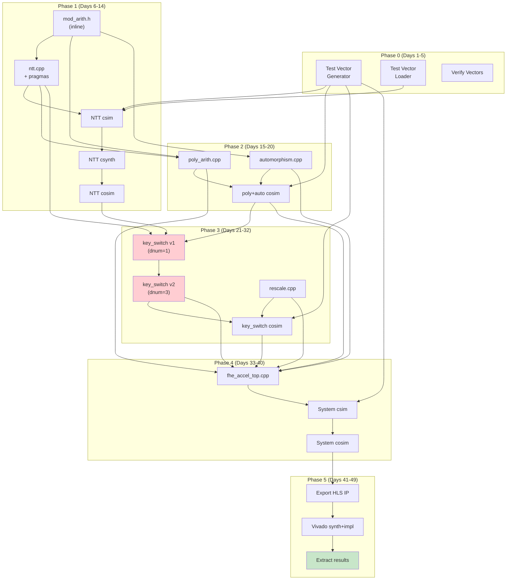

# Implementation Roadmap — Vitis HLS Sprint

> 7-week accelerated plan. All compute as HLS C++. SystemVerilog only for top-level integration.

---

## 1. Strategy: Why HLS-First

| Manual RTL (original) | Vitis HLS (revised) |
|-----------------------|---------------------|
| 16 weeks | **7 weeks** |
| Write every butterfly, FSM, address generator | Write synthesizable C++, add pragmas |
| Debug at waveform level | Debug in C simulation first |
| Separate testbench per module (SystemVerilog) | Single C++ testbench for csim AND cosim |
| AXI wrappers by hand | `#pragma HLS INTERFACE` auto-generates |
| Verification: days per module | Verification: minutes (csim) + hours (cosim) |

**Trade-off**: HLS may produce 1.5–2× less efficient hardware than hand-tuned RTL.
For a thesis prototype measuring architectural feasibility, this is acceptable.

---

## 2. Sprint Phases

### Phase 0: Infrastructure & Test Vectors (Days 1–5)

| Day | Task | Deliverable |
|-----|------|-------------|
| 1 | Create HLS project directory structure | `hardware_fpga_model/hls/` tree |
| 1 | Write `hls_params.h` with all constants | Compile-time parameter header |
| 2–3 | Write `test_vector_generator.cpp` linking OpenFHE | Extract primes, twiddles, NTT I/O, KS I/O |
| 3 | Build and run generator (N=16384, depth=10) | Binary files in `test_vectors/` |
| 4 | Write `test_vector_loader.h` for HLS testbench | C++ file-reader utilities |
| 5 | Write `verify_test_vectors.py` cross-check | Validate generator vs known OpenFHE values |

**Directory layout created in this phase:**
```
hardware_fpga_model/
├── hls/
│   ├── src/
│   │   ├── hls_params.h          ← compile-time constants
│   │   ├── mod_arith.h           ← inline mod_mul, mod_add, mod_sub
│   │   ├── ntt.h / ntt.cpp       ← NTT/INTT kernel
│   │   ├── poly_arith.h/cpp      ← poly add/sub/mul
│   │   ├── automorphism.h/cpp    ← Galois automorphism
│   │   ├── key_switch.h/cpp      ← key switching
│   │   ├── rescale.h/cpp         ← CKKS rescale
│   │   └── fhe_accel_top.h/cpp   ← top-level kernel with op dispatch
│   ├── tb/
│   │   ├── tb_fhe_accel.cpp      ← unified C++ testbench
│   │   └── test_vector_loader.h  ← binary file reader
│   ├── test_vectors/             ← generated binary golden vectors
│   ├── scripts/
│   │   ├── run_csim.tcl          ← Vitis HLS C simulation
│   │   ├── run_csynth.tcl        ← Vitis HLS C synthesis
│   │   ├── run_cosim.tcl         ← C/RTL co-simulation
│   │   └── run_export.tcl        ← export IP for Vivado
│   └── constraints/
│       └── timing.xdc            ← clock constraints
├── vivado/
│   ├── block_design.tcl          ← Vivado block design script
│   └── synth_impl.tcl            ← synthesis + implementation
└── reports/                      ← generated utilization/timing reports
```

```
integration_tools/
├── test_vector_generator.cpp     ← OpenFHE-linked test vector dumper
├── CMakeLists.txt                ← build for generator
└── verify_test_vectors.py        ← cross-validation script
```

> [!IMPORTANT]
> **Gate**: Phase 1 cannot start until test vectors are generated and validated.
> Every HLS testbench reads golden data from files — there is no OpenFHE dependency
> in the HLS build.

---

### Phase 1: Modular Arithmetic + NTT (Days 6–14)

| Day | Task | Deliverable |
|-----|------|-------------|
| 6 | Implement `mod_arith.h` (inline mod_mul, mod_add, mod_sub with `ap_uint<128>`) | Synthesizable header |
| 6 | Write standalone C test for modular arithmetic (read `tv_mod_arith.bin`) | Pass all 11K test cases |
| 7–8 | Implement `ntt.cpp` — single-limb in-place NTT | Working C model |
| 8 | Add `#pragma HLS PIPELINE II=1` to butterfly inner loop | Target II=1 |
| 9 | Add `#pragma HLS BIND_STORAGE` for URAM/BRAM mapping | Memory directives |
| 9 | Add `#pragma HLS ARRAY_PARTITION cyclic factor=NUM_BFLY*2` | Parallel memory access |
| 10 | C simulation: verify NTT against `tv_ntt_q*.bin` for all 11 primes | All primes pass |
| 10 | Verify INTT: `INTT(NTT(x)) == x` round-trip | Round-trip exact |
| 11 | Implement `ntt_all_limbs` wrapper | Multi-limb NTT |
| 12 | **First C synthesis** (`run_csynth.tcl`) — NTT only | Timing + resource report |
| 13 | Iterate pragmas: adjust `UNROLL factor`, `PIPELINE`, partition factors | Meet II=1 target |
| 14 | **First C/RTL co-simulation** — NTT only | Cycle-accurate verification |

**Phase 1 checkpoint**: NTT kernel passes csim with bit-exact correctness,
achieves II=1 on butterfly loop in csynth report, and passes cosim.

#### Pragma Iteration Workflow (Used in All Phases)

```
┌──────────────┐     ┌──────────────┐     ┌──────────────┐
│  C Simulation │────►│  C Synthesis  │────►│  Cosimulation │
│  (seconds)    │     │  (minutes)    │     │  (hours)      │
│               │     │               │     │               │
│  Functional   │     │  Check:       │     │  Cycle-exact  │
│  correctness  │     │  - II target  │     │  vs C model   │
│               │     │  - Latency    │     │               │
│               │     │  - Resources  │     │               │
└──────────────┘     └──────┬───────┘     └──────────────┘
                            │ fail?
                            ▼
                     Adjust pragmas,
                     refactor loops,
                     add/remove UNROLL
```

---

### Phase 2: Polynomial Arithmetic + Automorphism (Days 15–20)

| Day | Task | Deliverable |
|-----|------|-------------|
| 15 | Implement `poly_arith.cpp` — add, sub, coeff-wise mul | Working C model |
| 16 | Implement `automorphism.cpp` — Galois permutation | Working C model |
| 17 | Write testbench cases: `tv_poly_arith.bin`, `tv_automorphism.bin` | csim pass |
| 18 | Add HLS pragmas to both modules | Pipeline II=1 on inner loops |
| 19 | C synthesis: poly_arith + automorphism standalone | Reports |
| 20 | C/RTL co-simulation of both | Cycle-accurate pass |

**Phase 2 checkpoint**: poly_arith and automorphism pass cosim with correct
pragma scheduling. Both achieve streaming throughput (II=1 on coefficient loops).

---

### Phase 3: Key Switching + Rescale (Days 21–32)

> [!WARNING]
> **This is the highest-risk phase.** Key switching involves nested loops,
> global memory streaming, and multiple NTT calls. Budget extra time.

| Day | Task | Deliverable |
|-----|------|-------------|
| 21–22 | Implement `key_switch.cpp` — simplified version (dnum=1 first) | Working C model |
| 23 | Validate key switch against `tv_key_switch.bin` in csim | Bit-exact pass |
| 24 | Extend to dnum=3 (HYBRID decomposition) | Full key switch |
| 25–26 | Add HLS pragmas: pipeline inner MAC loop, bind URAM for accumulators | Target II=1 on MAC |
| 27 | C synthesis of key_switch standalone | Check latency, URAM usage |
| 28 | Implement `rescale.cpp` | Working C model |
| 29 | Validate rescale against `tv_rescale.bin` | csim pass |
| 30 | Add HLS pragmas to rescale | Pipeline coefficient loop |
| 31 | C synthesis: key_switch + rescale together | Combined resource report |
| 32 | C/RTL co-simulation of key_switch (longest single cosim) | Cycle-accurate pass |

#### Key Switch Simplification Strategy

```
Iteration 1 (Day 21-23): dnum=1, single digit
  - No RNS decomposition complexity
  - Just: NTT(ct1) × evk → INTT → result
  - Validates the core MAC accumulation + NTT reuse

Iteration 2 (Day 24-26): dnum=3, full HYBRID
  - Add digit extraction loop
  - Add multi-digit accumulation
  - Validate against full OpenFHE key switch output

Iteration 3 (Day 27-32): Optimize
  - Pipeline the evk streaming from global memory
  - Overlap NTT computation with memory loads
  - Use #pragma HLS DATAFLOW if applicable
```

**Phase 3 checkpoint**: Key switching passes cosim for all test vectors.
Synthesis report shows manageable URAM usage and reasonable latency.

---

### Phase 4: Top-Level Integration + System Cosim (Days 33–40)

| Day | Task | Deliverable |
|-----|------|-------------|
| 33 | Implement `fhe_accel_top.cpp` — op-code dispatch switch | Top-level kernel |
| 34 | Wire all sub-functions into top-level, add AXI interface pragmas | Synthesizable top |
| 35 | Write system testbench: sequence of operations for Phase 1 coarse distance | csim pass |
| 36 | Extend testbench: full interactive search (Phase 1 + Phase 2) | csim pass |
| 36 | Compare final decrypted result against software reference | Top-K match |
| 37 | C synthesis of full `fhe_accel_top` | Resource + latency report |
| 38 | Iterate: resolve resource conflicts, adjust memory binding | Meet FPGA capacity |
| 39–40 | C/RTL co-simulation of full design | Cycle-accurate full search |

> [!TIP]
> If full-search cosim takes too long (>24 hours), verify a subset:
> 1. Phase 1a only (coarse distance: 1 EvalSub + 1 EvalMult + 7 rotations)
> 2. Phase 2 single batch (1 EvalSub + 1 EvalMult + 7 rotations)
> These exercise all code paths with ~10% of the cycle count.

**Phase 4 checkpoint**: Top-level kernel synthesizes cleanly. At minimum,
a partial search (one batch) passes C/RTL co-simulation with bit-exact results.

---

### Phase 5: Vivado Synthesis & Characterization (Days 41–49)

| Day | Task | Deliverable |
|-----|------|-------------|
| 41 | Export HLS IP (`run_export.tcl`) | `.xo` or `.zip` IP package |
| 42 | Create Vivado block design with HLS IP + AXI interconnect | `block_design.tcl` |
| 43 | Run Vivado synthesis targeting Alveo U280 (or xcvu37p) | Synthesis report |
| 44 | Run Vivado implementation (place & route) | Implementation report |
| 45 | Extract results: LUT, FF, BRAM, URAM, DSP utilization | `utilization.rpt` |
| 46 | Extract timing: Fmax, WNS, critical path | `timing.rpt` |
| 47 | Run Vivado Power Analyzer | `power.rpt` |
| 48 | Compute cycle latency × clock period = wall-clock time | Performance table |
| 49 | Generate comparison table: HW vs SW (OpenFHE) | Thesis figures |

**Phase 5 deliverables** (thesis results):

| Metric | Value | Source |
|--------|-------|--------|
| LUT utilization | X / 1,304K | `utilization.rpt` |
| FF utilization | X / 2,607K | `utilization.rpt` |
| BRAM utilization | X / 2,016 | `utilization.rpt` |
| URAM utilization | X / 960 | `utilization.rpt` |
| DSP utilization | X / 9,024 | `utilization.rpt` |
| Clock frequency | X MHz | `timing.rpt` (WNS) |
| Cycles per query | X | cosim waveform |
| Latency per query | X ms | cycles / freq |
| SW reference latency | X ms | OpenFHE benchmark |
| Speedup | X× | HW latency / SW latency |
| Power | X W | Vivado Power Analyzer |
| Energy per query | X mJ | power × latency |

---

## 3. Dependency Graph



---

## 4. Critical Path

$$\text{Test Vectors} \xrightarrow{5d} \text{mod\_arith + NTT} \xrightarrow{9d} \text{key\_switch} \xrightarrow{12d} \text{top\_level} \xrightarrow{8d} \text{Vivado} \xrightarrow{9d} \text{Results}$$

**Total critical path: ~43 working days (8.5 weeks)** — aggressive but achievable.

Parallelizable work (off critical path):
- Poly arithmetic (Phase 2) runs in parallel with late Phase 1
- Automorphism (Phase 2) runs in parallel with poly arithmetic
- Rescale (Phase 3) runs in parallel with key switch debugging

---

## 5. Risk Assessment (HLS-Specific)

| Risk | Likelihood | Impact | Mitigation |
|------|-----------|--------|------------|
| **HLS fails to achieve II=1 on NTT butterfly** | Medium | High | Try `ARRAY_PARTITION complete` on smaller sub-arrays; accept II=2 if needed |
| **Key switch URAM exceeds capacity** | Medium | High | Stream one digit at a time; don't buffer all digits simultaneously |
| **`ap_uint<128>` multiply not mapping to DSPs** | Low | Medium | Use explicit DSP binding: `#pragma HLS BIND_OP variable=prod op=mul impl=dsp` |
| **C/RTL cosim too slow for full search** | High | Medium | Cosim partial search (single batch); extrapolate full cycle count |
| **Barrett reduction needs double correction** | Low | Low | Already handled in mod_mul (two conditional subtracts) |
| **HLS interface mismatch with Vivado block design** | Medium | Medium | Export with known AXI protocol; test in Vivado HW emulation |
| **OpenFHE NTT uses different twiddle ordering** | High | High | Extract twiddles directly from OpenFHE (don't compute independently) |

---

## 6. Vitis HLS TCL Scripts

### 6.1 `run_csim.tcl` — C Simulation

```tcl
open_project fhe_accel_proj
set_top fhe_accel_top
add_files src/fhe_accel_top.cpp
add_files src/ntt.cpp
add_files src/poly_arith.cpp
add_files src/automorphism.cpp
add_files src/key_switch.cpp
add_files src/rescale.cpp
add_files -tb tb/tb_fhe_accel.cpp
add_files -tb tb/test_vector_loader.h

open_solution "solution1" -flow_target vivado
set_part {xcu280-fsvh2892-2L-e}
set_clock_period 4  ;# 250 MHz

csim_design
```

### 6.2 `run_csynth.tcl` — C Synthesis

```tcl
# ... same project setup as csim ...
csynth_design
```

### 6.3 `run_cosim.tcl` — C/RTL Co-Simulation

```tcl
# ... same project setup ...
cosim_design -rtl verilog -tool xsim
```

### 6.4 `run_export.tcl` — Export IP

```tcl
# ... same project setup ...
export_design -format ip_catalog -output fhe_accel_ip.zip
# Or for Vitis flow:
# export_design -format xo -output fhe_accel.xo
```

---

## 7. Files to Create (Ordered by Implementation Sequence)

### Week 1 (Phase 0)

| # | File | Purpose |
|---|------|---------|
| 1 | `integration_tools/test_vector_generator.cpp` | OpenFHE-linked golden vector dumper |
| 2 | `integration_tools/CMakeLists.txt` | Build system for generator |
| 3 | `integration_tools/verify_test_vectors.py` | Cross-validation |
| 4 | `hardware_fpga_model/hls/src/hls_params.h` | All compile-time constants |

### Week 2 (Phase 1)

| # | File | Purpose |
|---|------|---------|
| 5 | `hardware_fpga_model/hls/src/mod_arith.h` | Inline mod_mul/add/sub with `ap_uint<128>` |
| 6 | `hardware_fpga_model/hls/src/ntt.h` | NTT function declarations |
| 7 | `hardware_fpga_model/hls/src/ntt.cpp` | NTT/INTT implementation with HLS pragmas |
| 8 | `hardware_fpga_model/hls/tb/test_vector_loader.h` | Binary file reader for testbench |
| 9 | `hardware_fpga_model/hls/tb/tb_fhe_accel.cpp` | Unified testbench (NTT section first) |
| 10 | `hardware_fpga_model/hls/scripts/run_csim.tcl` | C simulation script |
| 11 | `hardware_fpga_model/hls/scripts/run_csynth.tcl` | C synthesis script |
| 12 | `hardware_fpga_model/hls/scripts/run_cosim.tcl` | Co-simulation script |

### Week 3 (Phase 2)

| # | File | Purpose |
|---|------|---------|
| 13 | `hardware_fpga_model/hls/src/poly_arith.h` | Polynomial arithmetic declarations |
| 14 | `hardware_fpga_model/hls/src/poly_arith.cpp` | poly add/sub/mul with pragmas |
| 15 | `hardware_fpga_model/hls/src/automorphism.h` | Automorphism declarations |
| 16 | `hardware_fpga_model/hls/src/automorphism.cpp` | Galois permutation with pragmas |

### Week 4–5 (Phase 3)

| # | File | Purpose |
|---|------|---------|
| 17 | `hardware_fpga_model/hls/src/key_switch.h` | Key switch declarations |
| 18 | `hardware_fpga_model/hls/src/key_switch.cpp` | Full key switching with HLS pragmas |
| 19 | `hardware_fpga_model/hls/src/rescale.h` | Rescale declarations |
| 20 | `hardware_fpga_model/hls/src/rescale.cpp` | CKKS rescale with pragmas |

### Week 5–6 (Phase 4)

| # | File | Purpose |
|---|------|---------|
| 21 | `hardware_fpga_model/hls/src/fhe_accel_top.h` | Top-level declarations |
| 22 | `hardware_fpga_model/hls/src/fhe_accel_top.cpp` | Op dispatch + AXI interfaces |
| 23 | `hardware_fpga_model/hls/scripts/run_export.tcl` | IP export script |

### Week 7 (Phase 5)

| # | File | Purpose |
|---|------|---------|
| 24 | `hardware_fpga_model/vivado/block_design.tcl` | Vivado block design with HLS IP |
| 25 | `hardware_fpga_model/vivado/synth_impl.tcl` | Synthesis + implementation automation |
| 26 | `hardware_fpga_model/hls/constraints/timing.xdc` | Clock constraint (250 MHz) |

---

## 8. Definition of Done (Thesis Deliverables)

| Deliverable | Acceptance Criteria |
|-------------|-------------------|
| ✅ HLS C++ source | All kernels compile and pass csim |
| ✅ Test vectors | Generated from OpenFHE with HW-compatible params |
| ✅ C simulation pass | All operations match golden vectors (bit-exact) |
| ✅ C synthesis report | Latency, II, resource estimates per kernel |
| ✅ C/RTL co-simulation | At least partial search passes cycle-accurately |
| ✅ Vivado synthesis | Post-synthesis LUT/FF/BRAM/URAM/DSP numbers |
| ✅ Vivado implementation | Post-impl timing (Fmax, WNS) |
| ✅ Power report | Vivado Power Analyzer estimate |
| ✅ Performance comparison | Table: HW cycles/latency vs SW OpenFHE |
| ✅ Documentation | Architecture, assumptions, verification evidence |
