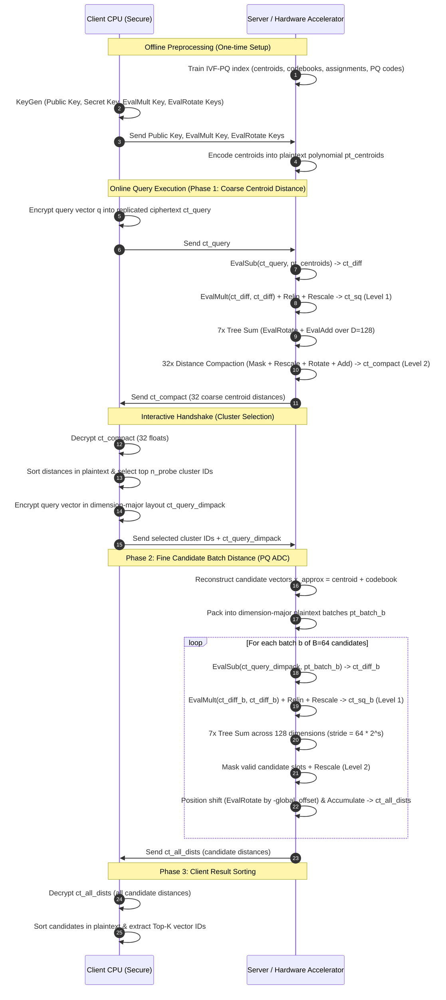

# Encrypted Interactive Search Protocol Specification

> **Target Mode:** `use_encryption=true, interactive=true`  
> **Reference Implementation:** `software_golden_model/fhe_core/fhe_searcher.cpp` & `fhe_context_manager.cpp`  
> **Hardware Target:** Vitis HLS Accelerator Prototype ($N=16384$, $L=11$, $P=4$)

---

## 1. Protocol Overview

The Encrypted Interactive Search mode executes a privacy-preserving Approximate Nearest Neighbor Search (ANNS) over an Inverted File with Product Quantization (IVF-PQ) index. In this mode, the client and server collaborate across two main phases with an intermediate decryption and cluster selection handshake.

---

## 2. Mathematical Details of Protocol Phases

### Phase 1a: Coarse Distance Computation

1. **Input Packing**:
   * Query vector $\mathbf{q} \in \mathbb{R}^{128}$ is replicated 32 times into SIMD slots:
     $$\text{slots}[c \cdot 128 + d] = q_d \quad \text{for } c \in [0, 31], \; d \in [0, 127]$$
   * Centroids matrix $\mathbf{C} \in \mathbb{R}^{32 \times 128}$ is packed identically into $\text{pt\_centroids}$.
2. **Difference Evaluation**:
   $$\text{ct\_diff} = \text{EvalSub}(\text{ct\_query}, \text{pt\_centroids}) \quad (\text{Level } 0, \; 11 \text{ limbs})$$
3. **Squaring & Rescale**:
   $$\text{ct\_sq} = \text{Rescale}(\text{EvalMult}(\text{ct\_diff}, \text{ct\_diff})) \quad (\text{Level } 1, \; 10 \text{ limbs})$$
4. **Tree Sum Reduction across 128 Dimensions**:
   $$\text{for } \text{stride} \in \{1, 2, 4, 8, 16, 32, 64\}: \quad \text{ct\_sq} \leftarrow \text{EvalAdd}(\text{ct\_sq}, \text{EvalRotate}(\text{ct\_sq}, \text{stride}))$$
   After 7 iterations, every slot at index $c \cdot 128$ holds the squared Euclidean distance:
   $$\text{slots}[c \cdot 128] = \|\mathbf{q} - \mathbf{C}_c\|^2$$

---

### Phase 1b: Distance Compaction

The 32 distances are strided at offsets $0, 128, 256, \dots, 3968$. To minimize client communication and decryption latency, the server compacts them into contiguous slots $0 \dots 31$:

$$\text{For } i = 0 \dots 31:$$
1. **Masking**: Multiply by single-slot indicator plaintext $\mathbf{m}_i$ (1.0 at index $i \cdot 128$, 0.0 elsewhere):
   $$\text{ct\_sel}_i = \text{Rescale}(\text{EvalMult}(\text{ct\_sq}, \text{pt\_mask}_i)) \quad (\text{Level } 2, \; 9 \text{ limbs})$$
2. **Left Shift**: Rotate by shift amount $i \cdot (128 - 1) = i \cdot 127$:
   $$\text{ct\_rot}_i = \text{EvalRotate}(\text{ct\_sel}_i, \; i \cdot 127)$$
3. **Accumulation**:
   $$\text{ct\_compact} = \sum_{i=0}^{31} \text{ct\_rot}_i$$
   Result: $\text{slots}[i] = \|\mathbf{q} - \mathbf{C}_i\|^2$ for $i \in [0, 31]$.

---

### Phase 2: Interactive Client Handshake

1. Server sends `ct_compact` ($L=9$ limbs) to the Client.
2. Client decrypts `ct_compact` to obtain array $D = [d_0, d_1, \dots, d_{31}]$.
3. Client sorts $D$ and selects the closest $n_{\text{probe}}$ coarse centroids (e.g. for $n_{\text{probe}}=1$, $c^* = \text{argmin}_i D[i]$).
4. Client sends the selected cluster ID $c^*$ back to the server.
5. Client encrypts query $\mathbf{q}$ into dimension-major layout `ct_query_dimpack`:
   $$\text{slots}[d \cdot B + j] = q_d \quad \text{for } d \in [0, 127], \; j \in [0, B-1] \quad (B = \text{Slots}/D = 64)$$

---

### Phase 3: Fine Batch Distance (PQ ADC)

1. **Candidate Reconstruction**:
   * Server looks up candidate vector IDs in cluster $c^*$: $\mathcal{V} = \text{cluster\_vector\_ids}[c^*]$.
   * Partitions candidates into batches of size $B=64$.
   * For each batch $b = \{v_0, v_1, \dots, v_{K-1}\}$ ($K \le 64$):
     $$\tilde{x}_{j}[d] = \mathbf{C}_{c^*}[d] + \text{codebooks}\big[m, \; \text{code}[v_j, m], \; d \bmod \text{sub\_dim}\big]$$
   * Packs candidate batch into dimension-major plaintext polynomial $\text{pt\_batch}_b$:
     $$\text{slots}[d \cdot B + j] = \tilde{x}_j[d]$$
2. **Homomorphic Batch Distance**:
   $$\text{ct\_diff}_b = \text{EvalSub}(\text{ct\_query\_dimpack}, \text{pt\_batch}_b) \quad (\text{Level } 0, \; 11 \text{ limbs})$$
   $$\text{ct\_sq}_b = \text{Rescale}(\text{EvalMult}(\text{ct\_diff}_b, \text{ct\_diff}_b)) \quad (\text{Level } 1, \; 10 \text{ limbs})$$
3. **Tree Sum Reduction across 128 Dimensions**:
   $$\text{for } s \in [0, 6]: \quad \text{stride} = B \cdot 2^s = 64 \cdot 2^s$$
   $$\text{ct\_sq}_b \leftarrow \text{EvalAdd}(\text{ct\_sq}_b, \text{EvalRotate}(\text{ct\_sq}_b, \text{stride}))$$
   After reduction: $\text{slots}[j] = \|\mathbf{q} - \tilde{\mathbf{x}}_j\|^2$ for $j \in [0, K-1]$.
4. **Mask & Accumulate**:
   * Mask valid candidate slots (0 to $K-1$):
     $$\text{ct\_masked}_b = \text{Rescale}(\text{EvalMult}(\text{ct\_sq}_b, \text{pt\_mask\_batch})) \quad (\text{Level } 2, \; 9 \text{ limbs})$$
   * Position shift to avoid collision with previously accumulated candidates:
     $$\text{ct\_shifted}_b = \text{EvalRotate}(\text{ct\_masked}_b, -\text{global\_offset})$$
     $$\text{ct\_all\_dists} \leftarrow \text{EvalAdd}(\text{ct\_all\_dists}, \text{ct\_shifted}_b)$$
     $$\text{global\_offset} \leftarrow \text{global\_offset} + K$$

---

### Phase 4: Final Top-K Extraction

1. Server sends `ct_all_dists` ($L=9$ limbs) to Client.
2. Client decrypts `ct_all_dists` to obtain distances for all candidates in the probed cluster.
3. Client pairs each distance with its global vector ID: $(v_j, \text{dist}_j)$.
4. Client sorts pairs in ascending distance order and returns the first $K$ elements ($\text{Top-}k$).

---

## 3. Multiplicative Depth & Noise Budget

| Step | Operation | Input Level | Output Level | Active Limbs ($L_\ell$) |
|---|---|---|---|---|
| Phase 1a | `EvalSub(ct_query, pt_centroids)` | 0 | 0 | 11 |
| Phase 1a | `EvalMult(ct_diff, ct_diff)` + `Rescale` | 0 | 1 | 10 |
| Phase 1a | 7x `EvalRotate` + `EvalAdd` (Tree Sum) | 1 | 1 | 10 |
| Phase 1b | `EvalMult(ct_sq, pt_mask)` + `Rescale` | 1 | 2 | 9 |
| Phase 1b | 32x `EvalRotate` + `EvalAdd` (Compaction) | 2 | 2 | 9 |
| Phase 2 | Client Decrypt (`ct_compact`) | 2 | — | Plaintext |
| Phase 3 | `EvalSub(ct_query_dimpack, pt_batch)` | 0 | 0 | 11 |
| Phase 3 | `EvalMult(ct_diff, ct_diff)` + `Rescale` | 0 | 1 | 10 |
| Phase 3 | 7x `EvalRotate` + `EvalAdd` (Tree Sum) | 1 | 1 | 10 |
| Phase 3 | `EvalMult(ct_sq, pt_mask_batch)` + `Rescale` | 1 | 2 | 9 |
| Phase 3 | `EvalRotate` + `EvalAdd` (Accumulate) | 2 | 2 | 9 |
| Phase 4 | Client Decrypt (`ct_all_dists`) | 2 | — | Plaintext |

> [!IMPORTANT]
> The entire interactive pipeline consumes exactly **2 multiplicative levels** in both Phase 1 and Phase 3. A modulus chain of $L+1 = 11$ RNS primes ($q_0 \dots q_{10}$) provides more than enough headroom, keeping the ciphertext size small (~2.8 MB at Level 0, ~2.2 MB at Level 2).

---

## 4. Key Switch Operation Inventory (Per Query)

| Phase | Operation Purpose | Shift Strides / Galois Elements | Number of Key Switches |
|---|---|---|---|
| **Phase 1a** | Coarse Tree Sum | $\{1, 2, 4, 8, 16, 32, 64\}$ | 7 |
| **Phase 1a** | Relin after Squaring | $\text{RelinKey}$ | 1 |
| **Phase 1b** | Distance Compaction Shifts | $i \cdot 127$ (decomposed into powers of 2) | 32 |
| **Phase 3** | Relin per batch (5 batches) | $\text{RelinKey}$ | 5 |
| **Phase 3** | Fine Tree Sum (5 batches) | $\{64, 128, 256, 512, 1024, 2048, 4096\}$ | $5 \times 7 = 35$ |
| **Phase 3** | Batch Position Shift (5 batches) | $-\text{global\_offset}$ | 5 |
| **Total** | | | **85 Key Switches** |

This confirms that key-switch acceleration is the dominant computational factor in hardware acceleration.
