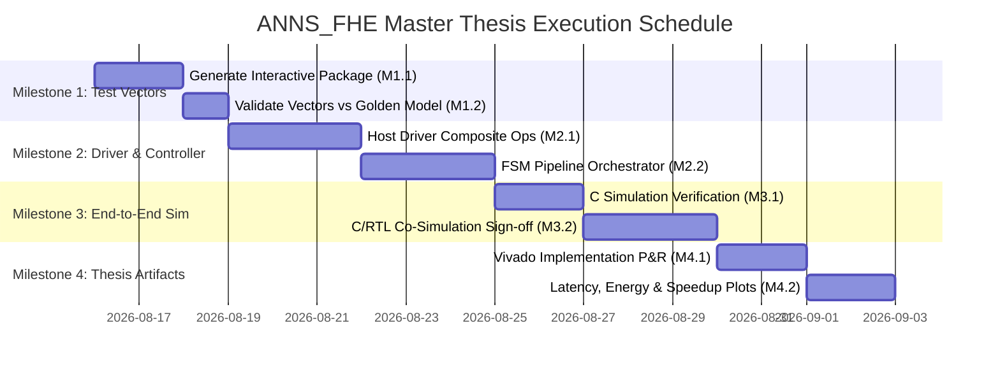

# Master Implementation Roadmap & Thesis Completion Plan

> **Target:** Complete End-to-End Hardware Simulation and Verification of the **Encrypted Interactive Search** mode for IVF-PQ ANNS over CKKS FHE.  
> **FPGA Platform:** AMD Virtex UltraScale+ (`xcvu37p-fsvh2892-2-e`)  
> **Toolchain:** Vitis HLS 2025.2, Vivado 2025.2, GCC 11+, Python 3.10+

---

## 1. Current State Assessment

As established in [`docs/implementation_log.md`](file:///d:/iman_heydardoost/master/thesis/ANNS_FHE/docs/implementation_log.md), all low-level hardware FHE compute primitives are **100% complete, verified bit-accurately, and synthesized with 0 errors**:

* `mod_arith` (64-bit modular add, sub, mul with 128-bit Barrett reduction) — ✅ **100% Bit-Exact**
* `ntt` (Forward Cooley-Tukey DIF NTT) & `intt` (Inverse Gentleman-Sande INTT) — ✅ **100% Bit-Exact**
* `poly_arith` (Poly Add, Sub, Mul in NTT domain) — ✅ **100% Bit-Exact**
* `automorphism` (Galois coefficient permutation) — ✅ **100% Bit-Exact**
* `rescale` (Centered reduction + drop last limb) — ✅ **100% Bit-Exact**
* `key_switch` (Hybrid key switching with FastBasesConv, AXI streaming eval keys, ApproxModDown) — ✅ **100% Bit-Exact**
* `fhe_accel_top` (Integrated top-level kernel with 512-bit AXI memory burst interfaces and URAM storage) — ✅ **100% Bit-Exact**
* **Vitis HLS Synthesis Sign-off**: Target 200 MHz, utilization: BRAM 20.6%, DSP 9.8%, FF 4.2%, LUT 13.1%, URAM 40.0%.

---

## 2. Master 4-Milestone Plan



---

### Milestone 1: Interactive Test Vector Generator & Infrastructure (Days 1–3)

**Objective:** Produce deterministic golden binary test vectors capturing every intermediate state of the Encrypted Interactive Search flow from OpenFHE.

| Step | Action | Responsible File | Expected Deliverable |
|---|---|---|---|
| **M1.1** | Implement interactive vector generator linking OpenFHE | `integration_tools/generate_interactive_test_vectors.cpp` | Compiles with `g++`/`cmake` |
| **M1.2** | Extract SIFT query 0 trace across Coarse Distance, Compaction, Selection, and PQ ADC | `integration_tools/test_vectors/tv_interactive_sift_q0.bin` | Full binary package (~1.2 GB with EvalKeys) |
| **M1.3** | Implement cross-validation Python test | `integration_tools/verify_interactive_trace.py` | Validates vector container format |

**Verification Gate M1:** `verify_interactive_trace.py` parses the binary container and verifies mathematical consistency.

---

### Milestone 2: C++ Host Orchestrator & Composite Operation Driver (Days 4–9)

**Objective:** Implement the high-level software orchestration layer in `cpp_host_model/` to chain low-level FHE primitives into complete composite operations.

| Step | Action | Responsible File | Expected Deliverable |
|---|---|---|---|
| **M2.1** | Create simulated memory bus bridge | `cpp_host_model/include/sim_memory_bus.h`, `sim_memory_bus.cpp` | 512-bit beat read/write access |
| **M2.2** | Implement composite FHE operations (`EvalMult`, `EvalRotate`, `EvalSub`, `EvalAdd`) | `cpp_host_model/include/fhe_host_driver.h`, `fhe_host_driver.cpp` | Invokes `fhe_accel_top()` sequentially |
| **M2.3** | Implement memory slot layout & rotation key directory | `cpp_host_model/src/fhe_host_driver.cpp` | Maps Galois elements to `key_gmem` |
| **M2.4** | Implement full query manager | `cpp_host_model/include/interactive_query_manager.h`, `interactive_query_manager.cpp` | Orchestrates Phase 1 $\to$ Handshake $\to$ Phase 2 |

**Verification Gate M2:** Standalone C++ host simulation compiles and executes `EvalMult` and `EvalRotate` bit-accurately against OpenFHE.

---

### Milestone 3: End-to-End System Simulation & Verification (Days 10–14)

**Objective:** Verify the entire interactive search pipeline end-to-end against the software Golden Model.

| Step | Action | Responsible File | Expected Deliverable |
|---|---|---|---|
| **M3.1** | Implement unified system testbench | `hardware_fpga_model/hls/src/tb_interactive_search.cpp` | Executes CP1 to CP6 |
| **M3.2** | Run C simulation (`csim_design`) | `hardware_fpga_model/hls/run_csim.tcl` | 100% Bit-Exact Match & 100% Recall Match |
| **M3.3** | Run C/RTL co-simulation (`cosim_design`) | `hardware_fpga_model/hls/run_cosim.tcl` | Cycle-accurate RTL waveform & latency extraction |

#### Verification Checkpoints Matrix

```
┌────────────────────────────────────────────────────────────────────────┐
│                        VERIFICATION CHECKPOINTS                        │
├──────┬──────────────────────────────┬──────────────────────────────────┤
│ CP1  │ Context & Key Material       │ Bit-exact match on all tables    │
├──────┼──────────────────────────────┼──────────────────────────────────┤
│ CP2  │ Coarse Centroid Distance     │ Bit-exact match on ct_sq         │
├──────┼──────────────────────────────┼──────────────────────────────────┤
│ CP3  │ Distance Compaction (32x)    │ Bit-exact match on ct_compact    │
├──────┼──────────────────────────────┼──────────────────────────────────┤
│ CP4  │ Interactive Client Handshake │ Selected cluster ID matches SW   │
├──────┼──────────────────────────────┼──────────────────────────────────┤
│ CP5  │ Fine Candidate Batch Distance│ Bit-exact match on ct_all_dists  │
├──────┼──────────────────────────────┼──────────────────────────────────┤
│ CP6  │ Top-K Ground Truth Recall    │ Recall@8 matches ground truth    │
└──────┴──────────────────────────────┴──────────────────────────────────┘
```

**Verification Gate M3:** C simulation and C/RTL co-simulation both exit with `0 ERRORS` and validate CP1–CP6.

---

### Milestone 4: Hardware Characterization & Thesis Artifacts (Days 15–18)

**Objective:** Synthesize, implement on FPGA, and generate publication-ready tables and graphs for the thesis.

| Step | Action | Responsible File | Expected Deliverable |
|---|---|---|---|
| **M4.1** | Export Vitis HLS IP package | `hardware_fpga_model/hls/run_export.tcl` | `.xo` / Vivado IP zip |
| **M4.2** | Run Vivado synthesis & place-and-route | `hardware_fpga_model/vivado/synth_impl.tcl` | Post-P&R timing & resource reports |
| **M4.3** | Run Vivado Power Analyzer | `hardware_fpga_model/vivado/power_analysis.tcl` | Power & energy report (`power.rpt`) |
| **M4.4** | Generate comparison graphs & speedup table | `docs/results/generate_thesis_plots.py` | LaTeX tables & vector PDF plots |

---

## 3. Thesis Deliverables & Results Summary

Upon completion of Milestone 4, the following thesis artifacts will be finalized:

1. **Hardware Resource Utilization Table** (Post-P&R on `xcvu37p`):
   * LUTs, FFs, BRAMs, URAMs, DSP48E2 utilization and percentage of device budget.
2. **Timing Closure Report**:
   * Target clock period: 5.0 ns (200 MHz), Worst Negative Slack (WNS), Total Negative Slack (TNS).
3. **Latency & Throughput Breakdown**:
   * Cycle count and execution time for Coarse Distance (Phase 1), Compaction (Phase 1b), and PQ ADC (Phase 2).
   * Comparison against single-threaded and multi-threaded CPU Golden Model.
4. **Energy Efficiency Comparison**:
   * Energy per query (mJ/query) for FPGA vs. Intel/AMD Server CPU.
5. **Recall & Accuracy Validation**:
   * Validation curve proving hardware Recall@K matches software Recall@K exactly across SIFT-10K.
