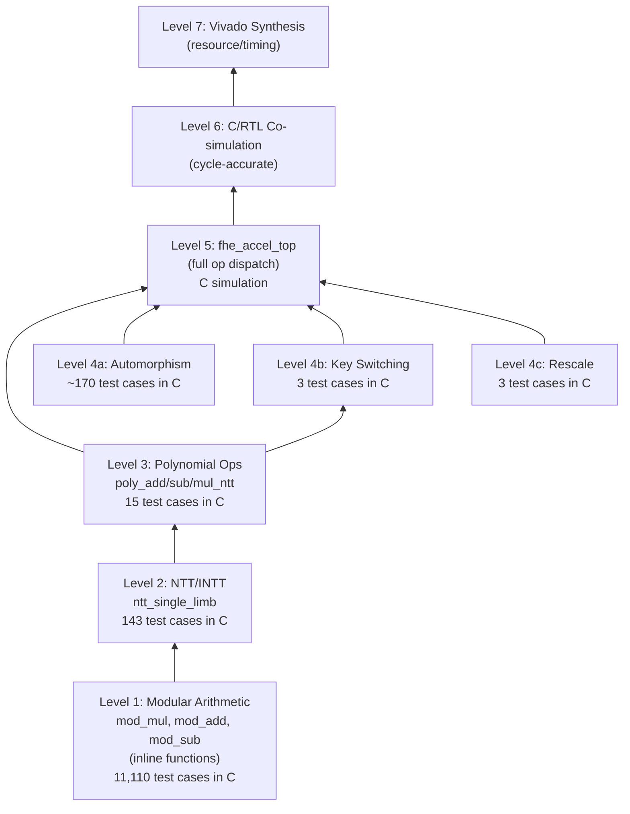

# Verification Plan — Vitis HLS-First

> Bottom-up verification via C simulation and C/RTL co-simulation, using software-generated test vectors.

---

## 1. Verification Philosophy

1. **Bottom-up**: Verify leaf functions first in C simulation, compose into top-level, verify again.
2. **Software is oracle**: Every test vector is generated from OpenFHE — never invented manually.
3. **Bit-exact for integers**: All modular arithmetic results must match OpenFHE exactly (no tolerance).
4. **Statistical for CKKS**: End-to-end encrypted search results are verified after decryption, allowing CKKS noise tolerance ($|\text{hw} - \text{sw}| < \epsilon$).
5. **Self-checking testbench**: A single C++ testbench (`tb_fhe_accel.cpp`) reads expected outputs and reports PASS/FAIL for all operations.
6. **Three verification tiers**: C simulation (seconds) → C synthesis (minutes) → C/RTL co-simulation (hours).

### Verification Tiers

| Tier | Tool | What it checks | Speed | When to use |
|------|------|---------------|-------|-------------|
| **C simulation** | `vitis_hls csim_design` | Functional correctness of C++ code | Seconds | Every code change |
| **C synthesis** | `vitis_hls csynth_design` | Latency, II, resource estimates, scheduling | Minutes | After csim passes |
| **C/RTL co-simulation** | `vitis_hls cosim_design` | Cycle-accurate RTL behavior matches C model | Hours | After csynth looks good |
| **Vivado synthesis** | `vivado synth_design` | Post-synthesis LUT/FF/BRAM/URAM/DSP/timing | 30–60 min | Final characterization |
| **Vivado implementation** | `vivado impl_design` | Post-P&R timing closure, power | 1–3 hours | Final characterization |

---

## 2. Test Vector Generation

### 2.1 Generator Program

**File**: `integration_tools/test_vector_generator.cpp`
**Build**: Links with OpenFHE (same CMake setup as `fhe_core`)
**Output**: Binary files in `hardware_fpga_model/hls/test_vectors/`

The generator creates a CryptoContext with **hardware-compatible parameters**:
```
N = 16384, mult_depth = 10, scale_bits = 45, first_mod = 60
security_level = HEStd_NotSet (to allow N=16384 with small depth)
```

### 2.2 Data Extraction Points

The generator must extract and save:

| Data | File | Format | Size |
|------|------|--------|------|
| RNS primes $q_0 \ldots q_{10}$ | `rns_primes.bin` | 11 × uint64 LE | 88 B |
| Barrett constants $(m_i, k_i)$ | `barrett_constants.bin` | 11 × (uint64, uint32) LE | 132 B |
| NTT twiddle factors per prime | `twiddles_q{i}.bin` | N/2 × uint64 LE | 64 KB each |
| INTT twiddle factors per prime | `inv_twiddles_q{i}.bin` | N/2 × uint64 LE | 64 KB each |
| $N^{-1} \bmod q_i$ | `n_inv.bin` | 11 × uint64 LE | 88 B |

### 2.3 Test Vector File Format

All test vector files use a simple binary format:

```
Header (32 bytes):
  magic:        uint32 = 0x46484554 ("FHET")
  version:      uint32 = 1
  N:            uint32 = polynomial degree
  num_limbs:    uint32 = L (number of RNS limbs)
  num_vectors:  uint32 = number of test cases
  word_width:   uint32 = 64
  reserved:     uint64 = 0

Per test case:
  [inputs]:     varies by test type
  [expected]:   varies by test type
```

### 2.4 Test Vector Categories

#### Category 1: Modular Arithmetic (`tv_mod_arith.bin`)

Per test case: `a[64], b[64], q[64], expected_mul[64], expected_add[64], expected_sub[64]`

Generation:
```cpp
// For each RNS prime q_i:
//   Generate 1000 random pairs (a, b) where 0 <= a, b < q_i
//   Compute: mul = (a * b) % q, add = (a + b) % q, sub = (a - b + q) % q
// Edge cases: a=0, b=0, a=q-1, b=q-1, a=b
// Total: 11 primes × 1010 cases = 11,110 test vectors
```

#### Category 2: NTT/INTT (`tv_ntt_q{i}.bin`)

Per test case: `input_poly[N], expected_ntt[N]` (both uint64 arrays)

Generation:
```cpp
// For each RNS prime q_i:
//   Create random polynomial (N coefficients in [0, q_i))
//   Extract OpenFHE's NTT result
//   Also test INTT: verify INTT(NTT(poly)) == poly
// Cases: 10 random + all-zeros + single-coeff + all-(q-1)
// Total: 11 primes × 13 cases = 143 NTT test vectors
```

#### Category 3: Polynomial Arithmetic (`tv_poly_arith.bin`)

Per test case: `poly_a[N×L], poly_b[N×L], expected_add[N×L], expected_sub[N×L], expected_mul[N×L]`

Generation:
```cpp
// Create two random polynomials with L RNS limbs each
// Compute add, sub, mul using OpenFHE
// Extract results in RNS form
// Cases: 5 random pairs
```

#### Category 4: Automorphism (`tv_automorphism.bin`)

Per test case: `galois_elt[32], input_poly[N×L], expected_poly[N×L]`

Galois elements needed for the interactive search (derived from rotation indices):
```
Rotation indices used:
  Tree sum: 1, 2, 4, 8, 16, 32, 64
  Compaction: multiples of 128
  Fine tree sum: 64, 128, 256, 512, 1024, 2048, 4096

Galois element for rotation by k: 5^k mod 2N (standard NTT-friendly mapping)
```

#### Category 5: Key Switching (`tv_key_switch.bin`)

Per test case: `input_ct1[N×L], evk[2×dnum×N×L], expected_ks_0[N×L], expected_ks_1[N×L]`

> [!WARNING]
> Key-switch test vectors are large: each eval key is ~8 MB.
> Store only 2–3 test cases. Verify correctness per-limb to enable
> early debugging.

#### Category 6: Rescale (`tv_rescale.bin`)

Per test case: `input_ct[2×N×L], expected_ct[2×N×(L-1)]`

#### Category 7: End-to-End Search Trace (`tv_search_trace.bin`)

A single full interactive search captured at every intermediate step.

---

## 3. C++ Testbench Structure

### 3.1 Unified Testbench (`tb_fhe_accel.cpp`)

A single C++ testbench file tests all operations. It works identically for:
- **C simulation** (`csim_design`) — fast functional check
- **C/RTL co-simulation** (`cosim_design`) — cycle-accurate verification

```cpp
// tb/tb_fhe_accel.cpp
#include "fhe_accel_top.h"
#include "test_vector_loader.h"
#include <cstdio>
#include <cstdlib>
#include <cstring>
#include <cassert>

// ========== TEST HELPER MACROS ==========
#define CHECK_EQUAL(name, actual, expected, count) do { \
    int mismatches = 0; \
    for (int i = 0; i < (count); i++) { \
        if ((actual)[i] != (expected)[i]) { \
            if (mismatches < 5) \
                printf("  MISMATCH %s[%d]: got 0x%016lx, expected 0x%016lx\n", \
                       name, i, (actual)[i], (expected)[i]); \
            mismatches++; \
        } \
    } \
    if (mismatches == 0) printf("  PASS: %s (%d words)\n", name, count); \
    else { printf("  FAIL: %s (%d mismatches)\n", name, mismatches); fail_count++; } \
} while(0)

int main() {
    int fail_count = 0;

    // Allocate simulated global memory (AXI-MM targets)
    uint64_t* poly_gmem = new uint64_t[POLY_GMEM_SIZE];
    uint64_t* key_gmem  = new uint64_t[KEY_GMEM_SIZE];

    // Load RNS parameters
    uint64_t rns_primes[MAX_LIMBS], barrett_m[MAX_LIMBS], n_inv[MAX_LIMBS];
    uint32_t barrett_k[MAX_LIMBS];
    load_rns_params("test_vectors/rns_primes.bin", rns_primes,
                    "test_vectors/barrett_constants.bin", barrett_m, barrett_k,
                    "test_vectors/n_inv.bin", n_inv);

    // ===== TEST 1: Modular Arithmetic =====
    printf("\n=== Test 1: Modular Arithmetic ===\n");
    test_mod_arith("test_vectors/tv_mod_arith.bin", &fail_count);

    // ===== TEST 2: NTT / INTT =====
    printf("\n=== Test 2: NTT / INTT ===\n");
    for (int q_idx = 0; q_idx < MAX_LIMBS; q_idx++) {
        char fname[256];
        snprintf(fname, sizeof(fname), "test_vectors/tv_ntt_q%d.bin", q_idx);
        test_ntt(fname, poly_gmem, rns_primes, barrett_m, barrett_k,
                 n_inv, q_idx, &fail_count);
    }

    // ===== TEST 3: Polynomial Arithmetic =====
    printf("\n=== Test 3: Polynomial Arithmetic ===\n");
    test_poly_arith("test_vectors/tv_poly_arith.bin", poly_gmem,
                    rns_primes, barrett_m, barrett_k, &fail_count);

    // ===== TEST 4: Automorphism =====
    printf("\n=== Test 4: Automorphism ===\n");
    test_automorphism("test_vectors/tv_automorphism.bin", poly_gmem,
                      rns_primes, &fail_count);

    // ===== TEST 5: Key Switching =====
    printf("\n=== Test 5: Key Switching ===\n");
    test_key_switch("test_vectors/tv_key_switch.bin", poly_gmem, key_gmem,
                    rns_primes, barrett_m, barrett_k, n_inv, &fail_count);

    // ===== TEST 6: Rescale =====
    printf("\n=== Test 6: Rescale ===\n");
    test_rescale("test_vectors/tv_rescale.bin", poly_gmem,
                 rns_primes, barrett_m, barrett_k, &fail_count);

    // ===== TEST 7: End-to-End Search Trace (if available) =====
    printf("\n=== Test 7: End-to-End Search ===\n");
    test_search_trace("test_vectors/tv_search_trace.bin", poly_gmem, key_gmem,
                      rns_primes, barrett_m, barrett_k, n_inv, &fail_count);

    // ===== SUMMARY =====
    printf("\n========================================\n");
    if (fail_count == 0)
        printf("ALL TESTS PASSED\n");
    else
        printf("FAILED: %d test(s)\n", fail_count);
    printf("========================================\n");

    delete[] poly_gmem;
    delete[] key_gmem;
    return fail_count;
}
```

### 3.2 Test Helper Functions

Each `test_*` function follows the pattern:

```cpp
void test_ntt(const char* tv_file, uint64_t* poly_gmem,
              const uint64_t primes[], const uint64_t bm[],
              const uint32_t bk[], const uint64_t n_inv[],
              int prime_idx, int* fail_count) {
    // 1. Load test vector from binary file
    TVHeader hdr;
    uint64_t input_poly[N], expected_ntt[N];
    FILE* f = fopen(tv_file, "rb");
    fread(&hdr, sizeof(TVHeader), 1, f);

    for (int tc = 0; tc < hdr.num_vectors; tc++) {
        fread(input_poly, sizeof(uint64_t), N, f);
        fread(expected_ntt, sizeof(uint64_t), N, f);

        // 2. Load input into simulated global memory
        memcpy(&poly_gmem[SRC_A_OFFSET], input_poly, N * sizeof(uint64_t));

        // 3. Call the HLS top-level kernel
        fhe_accel_top(
            (ap_uint<512>*)poly_gmem, (ap_uint<512>*)nullptr,
            OP_NTT, SRC_A_OFFSET, 0, DST_OFFSET,
            0, 1, prime_idx, 0, 0,
            primes, bm, bk, n_inv
        );

        // 4. Compare result against expected
        char label[64];
        snprintf(label, sizeof(label), "NTT q%d case %d", prime_idx, tc);
        CHECK_EQUAL(label, &poly_gmem[DST_OFFSET], expected_ntt, N);
    }
    fclose(f);
}
```

### 3.3 Test Vector Loader (`test_vector_loader.h`)

```cpp
// tb/test_vector_loader.h
#pragma once
#include <cstdio>
#include <cstdint>
#include <cstdlib>

struct TVHeader {
    uint32_t magic;       // 0x46484554
    uint32_t version;
    uint32_t N;
    uint32_t num_limbs;
    uint32_t num_vectors;
    uint32_t word_width;
    uint64_t reserved;
};

inline FILE* open_tv(const char* path, TVHeader* hdr) {
    FILE* f = fopen(path, "rb");
    if (!f) { printf("ERROR: Cannot open %s\n", path); exit(1); }
    fread(hdr, sizeof(TVHeader), 1, f);
    if (hdr->magic != 0x46484554) {
        printf("ERROR: Bad magic in %s\n", path);
        exit(1);
    }
    return f;
}

inline void load_rns_params(const char* primes_file,
                            uint64_t primes[],
                            const char* barrett_file,
                            uint64_t bm[], uint32_t bk[],
                            const char* ninv_file,
                            uint64_t n_inv[]) {
    FILE* f;
    f = fopen(primes_file, "rb");
    fread(primes, sizeof(uint64_t), MAX_LIMBS, f); fclose(f);
    f = fopen(barrett_file, "rb");
    for (int i = 0; i < MAX_LIMBS; i++) {
        fread(&bm[i], sizeof(uint64_t), 1, f);
        fread(&bk[i], sizeof(uint32_t), 1, f);
    }
    fclose(f);
    f = fopen(ninv_file, "rb");
    fread(n_inv, sizeof(uint64_t), MAX_LIMBS, f); fclose(f);
}
```

---

## 4. Verification Levels (HLS Flow)



### Level Progression Protocol

```
For each module (mod_arith → ntt → poly → auto → ks → rescale → top):

1. Write HLS C++ function (no pragmas initially)
2. Run csim → fix bugs until PASS
3. Add #pragma HLS PIPELINE, UNROLL, BIND_STORAGE
4. Run csynth → check II target, latency, resource estimate
5. Iterate pragmas until acceptable
6. Run cosim → verify cycle-accurate match
7. Move to next module
```

---

## 5. Individual Test Specifications

### 5.1 Modular Arithmetic (Level 1)

| Property | Value |
|----------|-------|
| Functions under test | `mod_mul()`, `mod_add()`, `mod_sub()` |
| Test vector file | `tv_mod_arith.bin` |
| Method | Direct C function call (no kernel invocation needed since these are inline) |
| Pass criteria | **Bit-exact match** for all 11,110 test cases |
| Coverage | All 11 primes, zero operands, max operands, equal operands |

### 5.2 NTT/INTT (Level 2)

| Property | Value |
|----------|-------|
| Function under test | `ntt_single_limb()` |
| Test vector files | `tv_ntt_q0.bin` through `tv_ntt_q10.bin` |
| Method | Call via `fhe_accel_top(OP_NTT, ...)` or direct function call |
| Pass criteria | Bit-exact match for all $N$ coefficients |
| Additional | Round-trip test: `INTT(NTT(poly)) == poly` |
| Cases | 143 NTT vectors + 143 round-trip checks |

### 5.3 Polynomial Arithmetic (Level 3)

| Property | Value |
|----------|-------|
| Functions under test | `poly_add_all()`, `poly_sub_all()`, `poly_mul_ntt_domain()` |
| Test vector file | `tv_poly_arith.bin` |
| Pass criteria | Bit-exact across all $N \times L$ coefficients |
| Cases | 5 random polynomial pairs × 3 operations |

### 5.4 Automorphism (Level 4a)

| Property | Value |
|----------|-------|
| Function under test | `automorphism()` |
| Test vector file | `tv_automorphism.bin` |
| Pass criteria | Bit-exact for all coefficients per limb |
| Cases | ~170 Galois elements × 2 test polynomials |

### 5.5 Key Switching (Level 4b)

| Property | Value |
|----------|-------|
| Function under test | `key_switch()` |
| Test vector file | `tv_key_switch.bin` |
| Method | Load input poly + eval key into simulated memory, call kernel |
| Pass criteria | Bit-exact per RNS limb |
| Cases | 3 key-switch operations |
| Debug strategy | Compare per-limb to isolate errors at specific RNS primes |

### 5.6 Rescale (Level 4c)

| Property | Value |
|----------|-------|
| Function under test | `rescale()` |
| Test vector file | `tv_rescale.bin` |
| Pass criteria | Bit-exact for remaining $L-1$ limbs |
| Cases | 3 rescale operations at different levels |

### 5.7 Top-Level Integration (Level 5)

| Property | Value |
|----------|-------|
| Function under test | `fhe_accel_top()` with full op-code dispatch |
| Test vector file | `tv_search_trace.bin` (intermediate checkpoints) |
| Method | Issue sequence of operations matching interactive search pipeline |
| Intermediate checks | After each op, compare against trace checkpoint |
| Final check | Decrypted distances match software within CKKS noise |
| Pass criteria | Top-K result IDs match software; distances within $10^{-3}$ relative error |

### 5.8 C/RTL Co-Simulation (Level 6)

| Property | Value |
|----------|-------|
| Testbench | Same `tb_fhe_accel.cpp` used for csim |
| Tool | `cosim_design -rtl verilog -tool xsim` |
| What it proves | Generated RTL produces identical results to C model |
| Expected duration | 2–8 hours (depending on test vector count) |
| If too slow | Reduce to: NTT (1 prime) + key switch (1 case) + rescale (1 case) |

---

## 6. C Assertion Strategy

Instead of SystemVerilog Assertions (SVA), we use C assertions and runtime checks:

```cpp
// In HLS source code (active during csim, stripped during synthesis)
#ifndef __SYNTHESIS__
    // Value range check
    assert(result < q && "Result exceeds modulus");

    // Latency tracking (csim only)
    static int op_count = 0;
    op_count++;
    printf("[DEBUG] mod_mul call #%d: a=%lu, b=%lu, q=%lu → r=%lu\n",
           op_count, a, b, q, result);
#endif
```

**Key pattern**: Wrap all debug/assertion code in `#ifndef __SYNTHESIS__`
so it is active during C simulation but excluded from hardware generation.

### Runtime Consistency Checks

```cpp
// In ntt_single_limb, before NTT:
#ifndef __SYNTHESIS__
    for (int i = 0; i < N; i++)
        assert(buf[i] < q && "Input coefficient exceeds modulus");
#endif

// After NTT:
#ifndef __SYNTHESIS__
    for (int i = 0; i < N; i++)
        assert(buf[i] < q && "NTT output coefficient exceeds modulus");
#endif

// Round-trip sanity (in testbench):
void verify_ntt_roundtrip(uint64_t poly[N], ...) {
    uint64_t backup[N];
    memcpy(backup, poly, N * sizeof(uint64_t));
    ntt_single_limb(poly, twiddles, q, bm, bk, n_inv, false);  // NTT
    ntt_single_limb(poly, inv_twiddles, q, bm, bk, n_inv, true); // INTT
    CHECK_EQUAL("NTT round-trip", poly, backup, N);
}
```

---

## 7. Vitis HLS TCL Scripts for Verification

### 7.1 `run_csim.tcl`

```tcl
open_project fhe_accel_proj
set_top fhe_accel_top

# Add source files
add_files src/fhe_accel_top.cpp
add_files src/ntt.cpp
add_files src/poly_arith.cpp
add_files src/automorphism.cpp
add_files src/key_switch.cpp
add_files src/rescale.cpp

# Add testbench files
add_files -tb tb/tb_fhe_accel.cpp
add_files -tb tb/test_vector_loader.h

open_solution "solution1" -flow_target vivado
set_part {xcu280-fsvh2892-2L-e}
set_clock_period 4  ;# 250 MHz target

csim_design
```

### 7.2 `run_csynth.tcl`

```tcl
# Same project setup as csim, then:
csynth_design
```

Output: `solution1/syn/report/fhe_accel_top_csynth.rpt` containing:
- Per-function latency (min/max cycles)
- Per-loop initiation interval (II)
- Resource estimates (LUT, FF, BRAM, URAM, DSP)
- Interface report (AXI ports generated)

### 7.3 `run_cosim.tcl`

```tcl
# Same project setup, then:
cosim_design -rtl verilog -tool xsim -trace_level all
```

Output:
- `solution1/sim/report/fhe_accel_top_cosim.rpt`
- Waveform in `solution1/sim/verilog/` (viewable with Vivado waveform viewer)
- Cycle count per kernel invocation

### 7.4 `run_export.tcl`

```tcl
# Same project setup, then:
export_design -format ip_catalog -output fhe_accel_ip.zip
# Or for Vitis platform flow:
# export_design -format xo -output fhe_accel.xo
```

---

## 8. Regression Automation

### 8.1 Makefile

```makefile
# hardware_fpga_model/hls/Makefile

HLS_DIR = $(CURDIR)
PROJ = fhe_accel_proj
VITIS_HLS = vitis_hls

.PHONY: csim csynth cosim export clean

# C Simulation — functional correctness (fast, run often)
csim:
	cd $(HLS_DIR) && $(VITIS_HLS) -f scripts/run_csim.tcl
	@echo "=== C Simulation Complete ==="

# C Synthesis — latency/resource estimation
csynth:
	cd $(HLS_DIR) && $(VITIS_HLS) -f scripts/run_csynth.tcl
	@echo "=== C Synthesis Complete ==="
	@echo "Report: $(PROJ)/solution1/syn/report/fhe_accel_top_csynth.rpt"

# C/RTL Co-Simulation — cycle-accurate verification
cosim:
	cd $(HLS_DIR) && $(VITIS_HLS) -f scripts/run_cosim.tcl
	@echo "=== Co-Simulation Complete ==="

# Export IP for Vivado integration
export:
	cd $(HLS_DIR) && $(VITIS_HLS) -f scripts/run_export.tcl
	@echo "=== IP Export Complete ==="

# Full verification pipeline
verify_all: csim csynth cosim
	@echo "=== Full Verification Pipeline Complete ==="

clean:
	rm -rf $(PROJ)
```

### 8.2 CI/Quick-Check Script

```bash
#!/bin/bash
# scripts/quick_check.sh — run after every code change
set -e
echo "=== Running C Simulation ==="
cd hardware_fpga_model/hls
make csim
echo "=== Checking synthesis feasibility ==="
make csynth
echo "=== All quick checks passed ==="
```

---

## 9. Csynth Report Metrics to Track

After each `csynth_design`, extract and record:

| Metric | Where to find | Target |
|--------|--------------|--------|
| `ntt_single_limb` latency | Per-function report | ≤ 15,000 cycles |
| `ntt_single_limb` butterfly II | Loop report | II = 1 |
| `key_switch` latency | Per-function report | ≤ 1,200,000 cycles |
| `key_switch` MAC loop II | Loop report | II = 1 |
| `poly_add_all` coefficient loop II | Loop report | II = 1 |
| `automorphism` permutation loop II | Loop report | II = 1 |
| Total URAM usage | Resource summary | ≤ 350 blocks (36% of U280) |
| Total BRAM usage | Resource summary | ≤ 500 blocks (25% of U280) |
| Total DSP usage | Resource summary | ≤ 150 (< 2% of U280) |
| Estimated clock (WNS) | Timing estimate | ≥ 200 MHz |

---

## 10. Known Verification Challenges (HLS-Specific)

| Challenge | Mitigation |
|-----------|------------|
| **`ap_uint<128>` behavior differs in csim vs RTL** | Use Xilinx arbitrary precision headers; verify with cosim |
| **Large arrays exceed HLS default memory** | Use `BIND_STORAGE` for URAM; test with reduced N=4096 first |
| **Key-switch cosim too slow** | Cosim with 1 test case only; trust csim for full coverage |
| **OpenFHE NTT twiddle ordering** | Extract directly from OpenFHE, don't compute independently |
| **HLS loop flattening changes behavior** | Avoid `LOOP_FLATTEN` on nested loops with complex index math |
| **Global memory simulation** | `ap_uint<512>*` must be properly cast; test burst patterns in csim |
| **Barrett reduction precision** | Verify Barrett constants match 64-bit precision; test all 11 primes |
| **CKKS noise in end-to-end test** | Per-operation tests are bit-exact; only E2E allows tolerance |

---

## 11. Post-Synthesis Verification

| Check | Method |
|-------|--------|
| Resource utilization | Vivado `report_utilization` after synthesis |
| Timing closure | Vivado `report_timing_summary` — check WNS ≥ 0 |
| Power estimate | Vivado `report_power` with switching activity from cosim |
| AXI interface correctness | Verified by HLS cosim (AXI protocol auto-generated) |
| Clock domain | Single clock domain (no CDC issues — HLS generates single-clock logic) |
